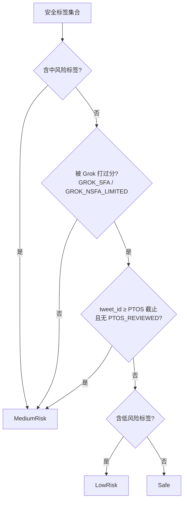
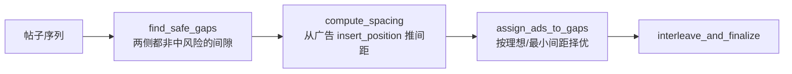
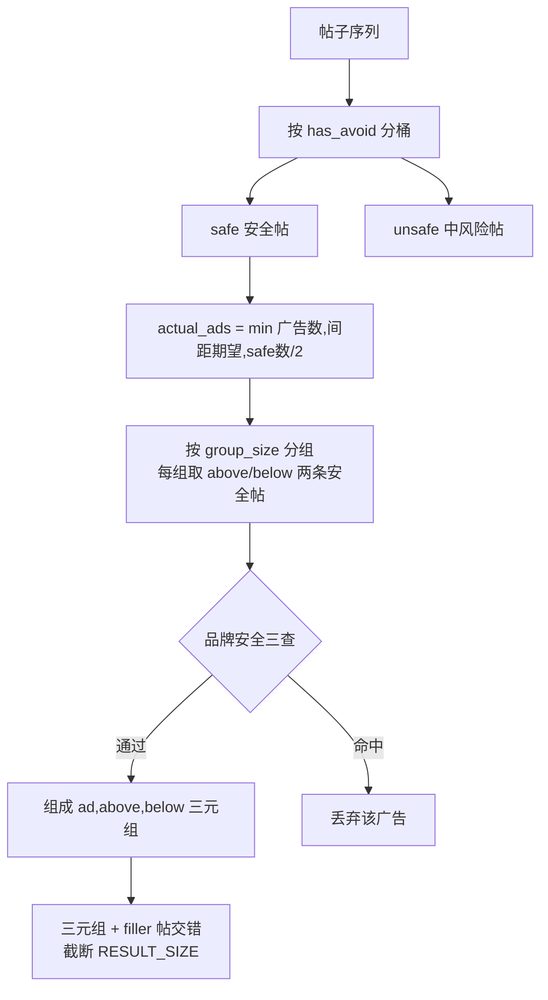

# 广告混排

## 这一页回答什么

广告如何被插进 For You 信息流、插在哪、以及"品牌安全"如何约束广告与帖子的相邻关系。

## 核心结论

1. **广告混排发生在外层流水线的选择器**:`BlenderSelector` 按 `AdsBlenderType` 参数二选一广告 blender。
2. **两种策略**:`SafeGapAdsBlender`(把广告塞进"安全间隙")与 `PartitionOrganicAdsBlender`(安全/不安全分桶 + 三元组插入)。
3. **品牌安全是硬约束**:`BrandSafetyVerdict` 四档;广告不与高风险帖相邻,低容忍广告还会回避与之冲突的帖子(风险等级 / 作者 handle / 关键词)。
4. **广告数量受限**:不足 5 条帖子不插广告;`PartitionOrganic` 下广告数 ≤ 安全帖数的一半。

## 在哪里发生

外层 [[home-mixer-orchestration|ForYouCandidatePipeline]] 的 `BlenderSelector` 把 `FeedItem` 按类型分桶后,选一个 blender 混排帖子与广告(`home-mixer/selectors/blender_selector.rs:41-47`):

```rust
let blender: &dyn AdsBlender = match query.params.get(AdsBlenderType).as_str() {
    "safe_gap" => &self.safe_gap_blender,
    _          => &self.partition_organic_blender,   // 默认
};
let mut blended = blender.blend(posts, ads);
```

混排完再插入 Prompt、Who-to-Follow、PushToHome(见 [[home-mixer-orchestration]])。

`AdsBlender` trait(`ads/mod.rs`)用模板方法:`blend()` 先记录帖子品牌安全裁定 / 广告风险统计,再调各实现的 `blend_inner()`。

## 品牌安全裁定

`BrandSafetyVerdict` 四档(`home-mixer/models/brand_safety.rs:5-12`):

| 档位 | 值 | 含义 |
|------|----|----|
| `Unspecified` | 0 | 未裁定 |
| `Safe` | 1 | 安全 |
| `LowRisk` | 2 | 低风险 |
| `MediumRisk` | 3 | 中风险(广告需回避) |

`compute_verdict()`(`brand_safety.rs:39-62`)由安全标签推导:



`MEDIUM_RISK_LABELS` 14 个(NSFW/NSFA 各档、暴力血腥、`DO_NOT_AMPLIFY`、`PDNA`、`EGREGIOUS_NSFW` 等),`LOW_RISK_LABELS` 3 个。`worst_verdict()` 取两个裁定中较差者(枚举值大者)。

图中 `tweet_id ≥ PTOS_CUTOFF_TWEET_ID`(一个固定常量 `2_054_275_414_225_846_272`)实为一个时间判断 —— X 的 tweet_id 是雪花 ID、随发布时间单调递增,所以"id 大于某常量"等价于"在某时刻之后发布";即截止点之后的新帖若未经 PTOS 复审(无 `PTOS_REVIEWED` 标签),保守地裁为 `MediumRisk`。

`has_avoid(post)`(`home-mixer/ads/util.rs:25-27`)就是 `brand_safety_verdict() == MediumRisk` —— blender 据此判断一个帖子是否"广告需回避"。

## 策略一:SafeGapAdsBlender

把广告塞进"安全间隙"——间隙两侧的帖子都不是 MediumRisk。



- **`find_safe_gaps`**(`util.rs:29-42`):间隙 `g`(在 `posts[g-1]` 与 `posts[g]` 之间)安全的条件是两侧帖子都非 `MediumRisk`。
- **`compute_spacing`**(`util.rs:44-65`):取前 4 条广告的 `insert_position` 差值最小值作为 `requested` 间距(≥ `MIN_REQUESTED_GAP=3`),否则用 `DEFAULT_SPACING {requested:3, min:2}`。
- **`assign_ads_to_gaps`**(`safe_gap_blender.rs:33-70`):逐条广告找最接近"理想位置"且不违反最小间距的安全间隙(`find_best_gap` 用 `partition_point` 二分)。
- 前置条件:广告非空且帖子数 ≥ `MIN_POSTS_FOR_ADS=5`,否则只返回帖子(`safe_gap_blender.rs:21-23`)。

## 策略二:PartitionOrganicAdsBlender(默认)

把帖子按品牌安全分桶,再以"帖-广告-帖"三元组插入。



关键步骤(`partition_organic_blender.rs:18-164`):

1. **分桶**:`has_avoid` 为真进 `unsafe_posts`,否则进 `safe`。
2. **限量**:`max_from_safe = safe_count / 2`;`actual_ads = min(广告数, 按间距估算的期望数, max_from_safe)` —— 广告最多占安全帖的一半。
3. **分组取帖**:`group_size = num_safe / actual_ads`,每个广告在其组首取 `above`、`below` 两条安全帖夹着。
4. **品牌安全三查**(命中任一则丢弃该广告):
   - `should_drop_bsr_low` —— 低容忍广告(风险 `BsrLow`/`BsrIas`)若紧邻 `LowRisk` 帖则丢
   - `should_drop_handle` —— 广告的 `ad_adjacency_control.handles` 含相邻帖作者
   - `should_drop_keyword` —— 广告的 `keywords` 经分词匹配相邻帖正文
5. **交错**:把 `(ad, above, below)` 三元组与剩余 filler 帖(其余安全帖 + 不安全帖,按分降序)交错排布。
6. **收尾**:`truncate(RESULT_SIZE)`,若末尾是广告则弹出,重排 `position`。

被丢弃的广告会记 `PartitionOrganic.enforcement` 指标(`action` 标签取 `drop`/`handle_drop`/`keyword_drop`,分别对应三类丢弃,`partition_organic_blender.rs:166-190`)。

## 设计决策

| 决策 | 选择 | 理由 |
|------|------|------|
| 混排放选择器 | `BlenderSelector` 内做广告混排 | 帖子已排好序,混排是"成品组装"的一部分 |
| 双策略 | safe_gap 与 partition_organic 由参数切换 | 可灰度对比两种混排哲学 |
| 品牌安全四档 | 由安全标签 + Grok 评分 + PTOS 推导 | 未被 Grok 评分或 PTOS 未审的新帖默认 MediumRisk,保守优先 |
| 广告数上限 | `≤ 安全帖数 / 2` | 防止广告过载,且保证每个广告都有安全帖夹着 |
| 三类相邻丢弃 | 风险等级 / handle / 关键词 | 广告主可声明回避的内容,违反则宁可不投 |
| 末尾去广告 | 截断后若末位是广告则弹出 | 信息流不以广告收尾 |

## FAQ

**Q:为什么帖子不足 5 条就不插广告?**
A:`MIN_POSTS_FOR_ADS = 5`。内容太少时插广告会让广告占比过高、体验差,直接只返回帖子(两个 blender 都有此前置判断)。

**Q:`should_drop_bsr_low` 为什么是"广告低风险、帖子低风险"才丢?**
A:这里"广告低风险"指广告主设了**低容忍度**的相邻控制(`BsrLow`/`BsrIas`)。这类广告即使紧邻 `LowRisk`(而非 Safe)帖子也不能接受,故丢弃。容忍度高的广告不受此限。

## 源码锚点

- `home-mixer/ads/mod.rs:12-20` —— `AdsBlender` trait 模板方法
- `home-mixer/ads/util.rs:25-65` —— `has_avoid`、`find_safe_gaps`、`compute_spacing`
- `home-mixer/ads/util.rs:79-151` —— 三类品牌安全相邻丢弃判定
- `home-mixer/ads/partition_organic_blender.rs:18-164` —— 默认混排策略
- `home-mixer/models/brand_safety.rs:39-62` —— `compute_verdict` 裁定逻辑

## 相关页面

- [[home-mixer-orchestration]] —— `BlenderSelector` 与外层流水线
- [[filtering-pipeline]] —— 帖子侧的可见性过滤(与品牌安全裁定不同)
- [[grox-classifiers]] —— 安全标签的上游产出方
- [[system-architecture]] —— 广告在整体数据流中的位置
