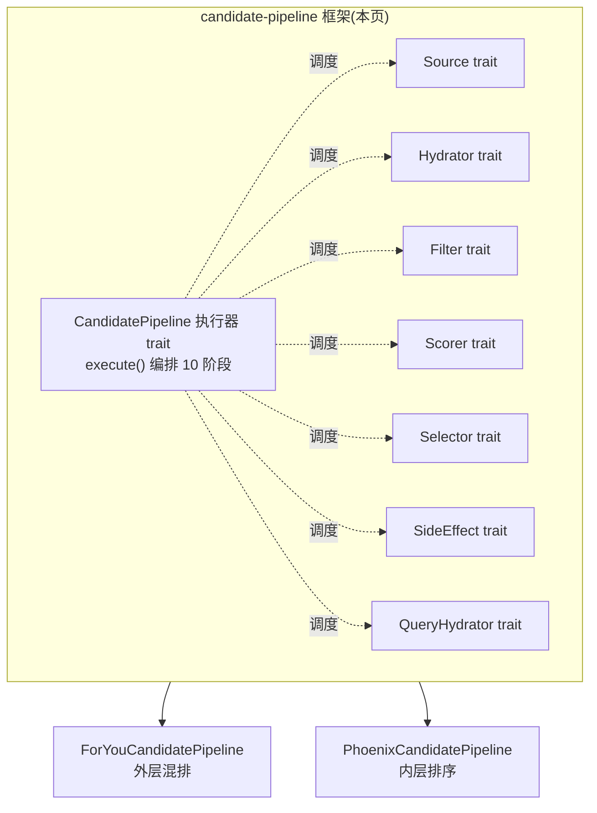
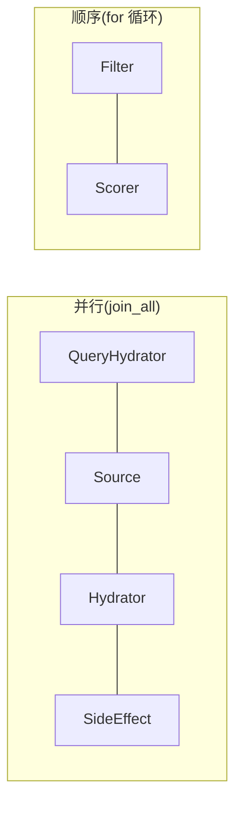

# candidate-pipeline 框架与七个组件 trait

## 这一页回答什么

`candidate-pipeline` 是 X For You 推荐系统里一个**可复用的 Rust 流水线框架**。它本身不知道"帖子""广告""召回"是什么 —— 它只定义了一套抽象:一条推荐流水线由哪些**阶段**组成、每个阶段插哪种**组件**、组件之间的**契约**是什么、哪些阶段**并行**哪些**顺序**。具体业务([[home-mixer-orchestration|ForYouCandidatePipeline]]、`PhoenixCandidatePipeline`)只负责往这些阶段里填组件。

本页讲框架的**组件生态**:7 个组件 trait(Source、Hydrator、Filter、Scorer、Selector、SideEffect、QueryHydrator)的签名、职责、契约。框架的**执行器**(`CandidatePipeline` trait 本身、`execute()` 编排)单独成页 —— 见 [[candidate-pipeline]]。

## 核心结论

1. **7 个组件 trait + 1 个执行器 trait**。组件 trait 各管一类工作;执行器 trait `CandidatePipeline` 把它们串成 10 个阶段。crate 根 `lib.rs` 仅 9 行,导出 9 个模块(`lib.rs:1-9`)。
2. **每个组件都是 trait,业务实现具体类型**。框架靠 trait object(`Box<dyn Source<Q,C>>` 等)持有组件,因此同一阶段可以挂任意多个异构组件。
3. **统一的 `enable()` 启用门**。7 个 trait 全部带 `fn enable(&self, query) -> bool`,默认返回 `true`。执行器在跑每个阶段前先按 `enable()` 过滤,实现按 query(实验、用户类型)动态开关组件。
4. **"水合不丢候选"是硬契约**。Hydrator 和 Scorer 返回的 `Vec` 必须与输入**等长且同序**;长度不符整批判 `Err` 跳过。要丢候选只能用 Filter 阶段。
5. **并行 vs 顺序是刻意设计**。Source / Hydrator / QueryHydrator / SideEffect 并行(彼此独立);Filter / Scorer 顺序(前序结果塑造后序上下文)。
6. **可观测性内建在 trait 里**。每个组件的 `run()` 方法都带 `#[tracing::instrument]` 和 `#[xai_stats_macro::receive_stats]`,无需业务代码手写埋点。

## 框架在系统里的位置



框架被 [[system-architecture|系统的两层流水线]] 共同复用:外层把帖子流和广告混排,内层做真正的召回/过滤/打分。两条流水线只是给同一组 trait 填入了不同的组件实例。

## 泛型参数 Q 与 C

每个组件 trait 都带两个泛型 `Q`(Query)和 `C`(Candidate),并对它们加了约束(`candidate_pipeline.rs:59-65`):

```rust
// candidate-pipeline/candidate_pipeline.rs:59-65
pub trait PipelineQuery: Clone + Send + Sync + 'static {
    fn params(&self) -> &xai_feature_switches::Params;
    fn decider(&self) -> Option<&xai_decider::Decider>;
}

pub trait PipelineCandidate: Clone + Send + Sync + 'static {}
impl<T> PipelineCandidate for T where T: Clone + Send + Sync + 'static {}
```

- `Q: PipelineQuery` —— 必须能拿到 `Params`(特征开关)和可选的 `Decider`(实验决策)。这是 `enable()` 能按实验开关组件的基础:组件实现拿 `query.params()` 查开关。
- `C: PipelineCandidate` —— 是个空 trait,对任何 `Clone + Send + Sync + 'static` 的类型自动实现。也就是说候选类型几乎无约束,框架只要求它可克隆、可跨线程。

`Send + Sync + 'static` 是因为流水线大量用 `tokio` 并发(`join_all`、`tokio::spawn`),候选和 query 要在线程间传递。

## 七个组件 trait

下面逐个讲。每个 trait 的共性:都带默认 `enable()`、都带 `name()`(用 `util::short_type_name` 取类型短名)、`run()` 是带埋点的模板方法、真正的业务逻辑在另一个方法里(`source()` / `hydrate()` / `filter()` / `score()` / `select()` / `side_effect()`)。

### 1. QueryHydrator —— 水合 Query

```rust
// candidate-pipeline/query_hydrator.rs:8-41
#[async_trait]
pub trait QueryHydrator<Q>: Any + Send + Sync
where
    Q: PipelineQuery,
{
    fn enable(&self, _query: &Q) -> bool { true }

    #[xai_stats_macro::receive_stats]
    #[tracing::instrument(skip_all, name = "query_hydrator", fields(name = self.name()))]
    async fn run(&self, query: &Q) -> Result<Q, String> {
        match self.hydrate(query).await {
            Ok(hydrated) => Ok(hydrated),
            Err(err) => {
                error!("Failed: {}", err);
                Err(err)
            }
        }
    }

    /// Hydrate the query by performing async operations.
    async fn hydrate(&self, query: &Q) -> Result<Q, String>;

    /// Update the query with the hydrated fields.
    /// Only the fields this hydrator is responsible for should be copied.
    fn update(&self, query: &mut Q, hydrated: Q);

    fn name(&self) -> &'static str { ... }
}
```

**职责**:在流水线最开头给 `Query` 补字段。请求进来时 `Query` 往往只有 `user_id`、设备信息;`QueryHydrator` 异步去拉用户的互动历史、关注列表、屏蔽名单、Bloom 过滤器等,塞进 query。后续所有阶段都能读到这些字段。

**唯一的泛型只有 `Q`** —— query 水合发生在还没有候选的时候,所以不涉及 `C`。

**`hydrate` / `update` 两段式**:`hydrate()` 是 async,做 I/O,返回一个"只填了自己那部分字段的新 query";`update()` 是同步的纯合并,把那部分字段拷回主 query。为什么分两步?因为多个 QueryHydrator **并行**跑(各自 `hydrate()`),不能让它们同时写一个 `&mut Q`;并行结束后执行器**顺序**逐个调 `update()` 合并,避免数据竞争。详见下文"并行如何不冲突"。

**错误处理**:`hydrate()` 失败返回 `Err(String)`,`run()` 记 `error!` 日志后把 `Err` 透传。执行器拿到 `Err` 就**跳过这个水合器的 `update()`**,query 缺这部分字段但流水线继续 —— 单个水合失败不拖垮整条流水线。

> 框架还提供 `dependent_query_hydrators`(依赖型 query 水合器),trait 类型与 `QueryHydrator` 完全相同,只是执行器在第一批 query 水合**之后**才跑它们,因此它们能读到第一批填好的字段。区别只在执行时机,不在 trait 定义。见 [[candidate-pipeline]]。

### 2. Source —— 拉候选

```rust
// candidate-pipeline/source.rs:8-39
#[async_trait]
pub trait Source<Q, C>: Any + Send + Sync
where
    Q: PipelineQuery,
    C: PipelineCandidate,
{
    fn enable(&self, _query: &Q) -> bool { true }

    #[xai_stats_macro::receive_stats(size=Bucket500To1000)]
    #[tracing::instrument(skip_all, name = "source", fields(name = self.name()))]
    async fn run(&self, query: &Q) -> Result<Vec<C>, String> {
        match self.source(query).await {
            Ok(candidates) => {
                info!("Fetched {} candidates", candidates.len());
                Ok(candidates)
            }
            Err(err) => {
                error!("Failed: {}", err);
                Err(err)
            }
        }
    }

    async fn source(&self, query: &Q) -> Result<Vec<C>, String>;

    fn name(&self) -> &'static str { ... }
}
```

**职责**:产出候选。一个 `Source` 就是一路候选来源 —— [[thunder-in-network-store|Thunder 站内库]]、[[phoenix-retrieval|Phoenix 召回]]、缓存、TweetMixer 等各是一个 Source 实现。多个 Source **并行**跑,产出的 `Vec<C>` 在执行器里被 `append` 拼成一个总候选池。

**返回 `Result<Vec<C>, String>`**:一路源挂了不影响其它源。执行器对 `results.into_iter().flatten()` —— `Err` 直接被 `flatten` 丢弃,只有 `Ok` 的候选进池。这意味着**某个召回服务超时或报错,流水线照常用其它源的候选出结果**。

**埋点**:`#[receive_stats(size=Bucket500To1000)]` 表示框架自动把每个 source 返回的候选数记进 500~1000 的直方图桶 —— 单源候选规模通常在这个量级。

### 3. Hydrator —— 水合候选

```rust
// candidate-pipeline/hydrator.rs:10-67
#[async_trait]
pub trait Hydrator<Q, C>: Any + Send + Sync
where
    Q: PipelineQuery,
    C: PipelineCandidate,
{
    fn enable(&self, _query: &Q) -> bool { true }

    /// IMPORTANT: The returned vector must have the same candidates in the
    /// same order as the input. Dropping candidates in a hydrator is not
    /// allowed - use a filter stage instead.
    async fn hydrate(&self, query: &Q, candidates: &[C]) -> Vec<Result<C, String>>;

    #[xai_stats_macro::receive_stats(latency=Bucket50To500, size=Bucket500To2500)]
    #[tracing::instrument(skip_all, name = "hydrator", fields(name = self.name()))]
    async fn run(&self, query: &Q, candidates: &[C]) -> Vec<Result<C, String>> {
        let hydrated = self.hydrate(query, candidates).await;
        let expected_len = candidates.len();
        if hydrated.len() == expected_len {
            hydrated
        } else {
            let message = format!(
                "Hydrator length_mismatch expected={} got={}",
                expected_len, hydrated.len()
            );
            warn!("Skipped: length_mismatch expected={} got={}",
                expected_len, hydrated.len());
            vec![Err(message); expected_len]
        }
    }

    /// Update a single candidate with the hydrated fields.
    /// Only the fields this hydrator is responsible for should be copied.
    fn update(&self, candidate: &mut C, hydrated: C);

    /// Update all successfully hydrated candidates.
    fn update_all(&self, candidates: &mut [C], hydrated: Vec<Result<C, String>>) {
        for (candidate, hydrated) in candidates.iter_mut().zip(hydrated) {
            if let Ok(hydrated) = hydrated {
                self.update(candidate, hydrated);
            }
        }
    }

    fn name(&self) -> &'static str { ... }
}
```

**职责**:给已有的候选补字段。Source 产出的候选往往只有 `post_id`;`Hydrator` 异步去拉帖子正文、作者信息、媒体时长、是否含媒体、是否订阅内容等,填进候选。多个 Hydrator **并行**作用于**同一份**候选集。

**长度不变量(关键契约)**:trait 文档明写 —— `hydrate()` 返回的 `Vec` 必须与输入候选**等长、同序**,不许丢候选。`run()` 是模板方法,会强制校验 `hydrated.len() == expected_len`;一旦不等,**整批替换成 `vec![Err(...); expected_len]`** 并记 `warn!` 日志。这样长度永远对得上,后续 `zip` 不会错位。**要剔除候选必须用 Filter 阶段**,Hydrator 不行。

**逐元素 `Result`**:返回 `Vec<Result<C, String>>` —— 每个候选独立成败。某条帖子的正文拉取失败是 `Err`,`update_all()` 跳过它(`if let Ok`),该候选保留原样进下一阶段;其它候选正常水合。

**`update` / `update_all` 两段式**:同 QueryHydrator 的理由 —— 并行 `hydrate()` 产出结果,顺序 `update_all()` 合并。`update_all()` 有默认实现(`zip` 后逐个 `update`),业务通常只需实现单条的 `update()`。

**埋点**:`latency=Bucket50To500`(单个 hydrator 50~500ms)、`size=Bucket500To2500`(候选规模)。

#### CachedHydrator —— 带缓存的水合器

`hydrator.rs` 里还有一个子机制:`CachedHydrator`(`hydrator.rs:78-115`)。它不是另一个流水线阶段,而是 `Hydrator` 的一种**实现方式**。框架提供了一个 blanket impl:任何实现了 `CachedHydrator` 的类型自动获得 `Hydrator` 实现(`hydrator.rs:117-189`)。

```rust
// candidate-pipeline/hydrator.rs:78-96(节选)
#[async_trait]
pub trait CachedHydrator<Q, C>: Any + Send + Sync
where Q: PipelineQuery, C: PipelineCandidate,
{
    type CacheKey: Eq + Hash + Send + Sync + 'static;
    type CacheValue: Clone + Send + Sync + 'static;

    fn cache_store(&self) -> &dyn CacheStore<Self::CacheKey, Self::CacheValue>;
    fn cache_key(&self, candidate: &C) -> Self::CacheKey;
    fn cache_value(&self, hydrated: &C) -> Self::CacheValue;
    fn hydrate_from_cache(&self, value: Self::CacheValue) -> C;
    async fn hydrate_from_client(&self, query: &Q, candidates: &[C]) -> Vec<Result<C, String>>;
    fn update(&self, candidate: &mut C, hydrated: C);
    ...
}
```

blanket impl 的 `hydrate()` 逻辑(`hydrator.rs:128-184`):

1. 逐候选算 `cache_key`,查 `cache_store`。命中(`Some`)直接 `hydrate_from_cache`,`cache_hits += 1`;未命中收集到 `missing_*` 三个并行向量,`cache_misses += 1`。
2. 调 `stat_cache(hits, misses)`,把命中/未命中数发进 `*.cache` 指标(`CACHE_HIT_SCOPE` / `CACHE_MISS_SCOPE`)。
3. 对未命中的候选批量调 `hydrate_from_client()`(真正的远程拉取)。这里也有长度校验:若 `hydrated_missing.len() != missing_candidates.len()`,**整批返回 `Err`**。
4. 远程结果里成功的(`Ok`)调 `cache_value` 算缓存值、`insert` 回缓存;按 `missing_indices` 填回结果数组对应位置。
5. 最终把 `Vec<Option<Result<C,String>>>` 摊平成 `Vec<Result<C,String>>`,空位补 `Err("Missing hydration result for candidate")`。

`CacheStore<K,V>` 自身也是个 trait(`hydrator.rs:72-76`),只有 async 的 `get` / `insert` 两个方法,具体缓存(Redis、内存)由业务实现。这套设计让"先查缓存、未命中才远程拉、拉到再回填"成为框架级能力,业务只填 5 个回调即可。

### 4. Filter —— 过滤候选

```rust
// candidate-pipeline/filter.rs:10-70
pub struct FilterResult<C> {
    pub kept: Vec<C>,
    pub removed: Vec<C>,
}

/// Filters run sequentially and partition candidates into kept and removed sets
pub trait Filter<Q, C>: Any + Send + Sync
where
    Q: PipelineQuery,
    C: PipelineCandidate,
{
    fn enable(&self, _query: &Q) -> bool { true }

    #[xai_stats_macro::receive_stats(latency=Bucket0To50)]
    #[tracing::instrument(skip_all, name = "filter", fields(
        name = self.name(),
        input_count = candidates.len(),
        kept_count = Empty, removed_count = Empty, filter_rate = Empty,
    ))]
    fn run(&self, query: &Q, candidates: Vec<C>) -> FilterResult<C> {
        let result = self.filter(query, candidates);
        let total = result.kept.len() + result.removed.len();
        let rate = if total > 0 {
            result.removed.len() as f64 / total as f64
        } else { 0.0 };
        let span = Span::current();
        span.record("kept_count", result.kept.len());
        span.record("removed_count", result.removed.len());
        span.record("filter_rate", format!("{:.3}", rate).as_str());
        self.stat(&result);
        result
    }

    fn filter(&self, query: &Q, candidates: Vec<C>) -> FilterResult<C>;

    fn name(&self) -> &'static str { ... }
    fn stat(&self, result: &FilterResult<C>) { ... }
}
```

**职责**:剔除不该出现的候选 —— 可见性过滤、去重、社交图规则等。这是框架里**唯一能合法丢候选**的阶段。

**`Filter` 不是 async**。`run()` 和 `filter()` 都是同步方法,trait 不带 `#[async_trait]`。因为过滤判断基于候选**已经水合好的字段**(由前面的 Hydrator 填),纯内存计算,不需要 I/O。

**`FilterResult` 一分为二**:`filter()` 返回 `{ kept, removed }`,候选被显式分进两堆。`kept` 进下一阶段,`removed` 被执行器收集起来(进 `PipelineResult.filtered_candidates`,可用于调试/日志)。没有"沉默丢弃"。

**顺序执行**:trait 文档明写 "Filters run sequentially"。执行器在 `run_filters` 里把上一个 filter 的 `kept` 当下一个 filter 的输入(`candidate_pipeline.rs:365-372`)。顺序的意义:前序过滤先把候选集缩小,后序过滤在更小的集合上跑;且某些过滤逻辑依赖"前面已经清过某类候选"的前提。

**埋点**:`latency=Bucket0To50`(过滤是纯内存,极快);`stat()` 把 `kept` / `removed` 计数发进 `*.run` 指标。

### 5. Scorer —— 给候选打分

```rust
// candidate-pipeline/scorer.rs:8-65
#[async_trait]
pub trait Scorer<Q, C>: Send + Sync
where
    Q: PipelineQuery,
    C: PipelineCandidate,
{
    fn enable(&self, _query: &Q) -> bool { true }

    #[xai_stats_macro::receive_stats]
    #[tracing::instrument(skip_all, name = "scorer", fields(name = self.name()))]
    async fn run(&self, query: &Q, candidates: &[C]) -> Vec<Result<C, String>> {
        let scored = self.score(query, candidates).await;
        let expected_len = candidates.len();
        if scored.len() == expected_len {
            scored
        } else {
            let message = format!(
                "Scorer length_mismatch expected={} got={}",
                expected_len, scored.len()
            );
            warn!("Skipped: length_mismatch expected={} got={}",
                expected_len, scored.len());
            vec![Err(message); expected_len]
        }
    }

    /// IMPORTANT: The returned vector must have the same candidates in the
    /// same order as the input. Dropping candidates in a hydrator is not
    /// allowed - use a filter stage instead.
    async fn score(&self, query: &Q, candidates: &[C]) -> Vec<Result<C, String>>;

    fn update(&self, candidate: &mut C, scored: C);

    fn update_all(&self, candidates: &mut [C], scored: Vec<Result<C, String>>) {
        for (candidate, scored) in candidates.iter_mut().zip(scored) {
            if let Ok(scored) = scored {
                self.update(candidate, scored);
            }
        }
    }

    fn name(&self) -> &'static str { ... }
}
```

**职责**:更新候选的 score 字段。`PhoenixScorer` 调 [[phoenix-ranking|Phoenix 排序模型]] 拿多种互动概率,`RankingScorer` 把它们加权成最终分。详见 [[scoring-and-ranking]]。

**结构和 Hydrator 几乎一模一样** —— 同样 async、同样返回 `Vec<Result<C, String>>`、同样的**等长契约**(`run()` 校验 `scored.len() == expected_len`,不符整批 `Err`)、同样 `update` / `update_all` 两段式。trait 文档甚至复用了 Hydrator 那句 "Dropping candidates in a hydrator is not allowed"(注意原文这里写的是 "hydrator",应理解为泛指水合/打分类组件)。

**与 Hydrator 的唯一实质区别是执行模型**:Scorer **顺序**执行,Hydrator 并行。原因 —— 打分有链式依赖:`RankingScorer` 的加权要用到 `PhoenixScorer` 已经填好的概率字段。顺序跑才能保证后一个 scorer 看到前一个的输出。

`Scorer` 的约束是 `Send + Sync`(没有 `Any`),`Hydrator` 是 `Any + Send + Sync` —— 细微差别,`Any` 让 trait object 支持向下转型(downcast),Scorer 不需要。

### 6. Selector —— 选择与排序

```rust
// candidate-pipeline/selector.rs:6-85
pub struct SelectResult<C> {
    pub selected: Vec<C>,
    pub non_selected: Vec<C>,
}

pub trait Selector<Q, C>: Send + Sync
where
    Q: PipelineQuery,
    C: PipelineCandidate,
{
    fn enable(&self, _query: &Q) -> bool { true }

    #[xai_stats_macro::receive_stats(latency=Bucket0To50, size=Bucket0To50)]
    #[tracing::instrument(skip_all, name = "selector", fields(
        name = self.name(),
        input_count = candidates.len(),
        selected_count = Empty, non_selected_count = Empty,
    ))]
    fn run(&self, query: &Q, candidates: Vec<C>) -> SelectResult<C> {
        let result = self.select(query, candidates);
        let span = Span::current();
        span.record("selected_count", result.selected.len());
        span.record("non_selected_count", result.non_selected.len());
        result
    }

    // Returns (selected, non_selected).
    fn select(&self, _query: &Q, candidates: Vec<C>) -> SelectResult<C> {
        let mut sorted = self.sort(candidates);
        if let Some(limit) = self.size() {
            let non_selected = sorted.split_off(limit.min(sorted.len()));
            SelectResult { selected: sorted, non_selected }
        } else {
            SelectResult { selected: sorted, non_selected: vec![] }
        }
    }

    /// Extract the score from a candidate to use for sorting.
    fn score(&self, candidate: &C) -> f64;

    /// Sort candidates by their scores in descending order.
    fn sort(&self, candidates: Vec<C>) -> Vec<C> {
        let mut sorted = candidates;
        sorted.sort_by(|a, b| {
            self.score(b).partial_cmp(&self.score(a))
                .unwrap_or(std::cmp::Ordering::Equal)
        });
        sorted
    }

    /// Optionally provide a size to select. Defaults to no truncation.
    fn size(&self) -> Option<usize> { None }

    fn name(&self) -> &'static str { ... }
}
```

**职责**:把打好分的候选**排序 + 截断**,产出最终入选名单。一条流水线**只有一个** Selector(执行器里 `selector()` 返回 `&dyn Selector`,单数,不是切片)。

**最省事的 trait** —— `select()`、`sort()`、`size()` 全有默认实现。业务最少**只需实现 `score()` 一个方法**(从候选里取出分数),框架自动:`sort()` 按分数降序排;`size()` 默认 `None`(不截断),若 override 返回 `Some(limit)` 则 `split_off` 出 `non_selected`。

**`partial_cmp` 兜底**:`sort()` 用 `partial_cmp(...).unwrap_or(Ordering::Equal)` —— 分数是 `f64`,可能出现 `NaN` 导致 `partial_cmp` 返回 `None`,这里兜底成"相等"避免 panic。

**同步、非 async**:排序截断是纯计算。

**`SelectResult` 的辅助方法**(`selector.rs:11-19`):`len()` 返回 `selected.len()`;`is_empty()` 要求 `selected` 和 `non_selected` **都空**。

### 7. SideEffect —— 副作用

```rust
// candidate-pipeline/side_effect.rs:9-37
#[derive(Clone)]
pub struct SideEffectInput<Q, C> {
    pub query: Arc<Q>,
    pub selected_candidates: Vec<C>,
    pub non_selected_candidates: Vec<C>,
}

#[async_trait]
pub trait SideEffect<Q, C>: Send + Sync
where
    Q: PipelineQuery,
    C: PipelineCandidate,
{
    /// Decide if this side-effect should be run
    fn enable(&self, _query: Arc<Q>) -> bool { true }

    #[xai_stats_macro::receive_stats]
    async fn run(&self, input: Arc<SideEffectInput<Q, C>>) -> Result<(), String> {
        self.side_effect(input).await
    }

    async fn side_effect(&self, input: Arc<SideEffectInput<Q, C>>) -> Result<(), String>;

    fn name(&self) -> &'static str { ... }
}
```

**职责**:做"不影响返回结果"的事 —— 文件头注释明写 "A side-effect is an action run that doesn't affect the pipeline result from being returned"。典型用途:把 seen ids / served candidates 发 Kafka、写 Redis 缓存、更新用户的 served history、发实验日志。

**输入是 `Arc<SideEffectInput>`**:`SideEffectInput` 打包了最终 query、入选候选、落选候选三样。用 `Arc` 包是因为多个 side effect 并行跑、共享同一份输入,`Arc` 避免逐个克隆大向量。

**`enable()` 签名不同**:其它 6 个 trait 的 `enable(&self, &Q)` 收引用,只有 `SideEffect::enable(&self, Arc<Q>)` 收 `Arc` —— 因为 side effect 在 `tokio::spawn` 出去的后台任务里执行,`Arc<Q>` 已经是现成的共享句柄。

**返回值被丢弃**:`run()` 返回 `Result<(), String>`,但执行器对 side effect 的 join 结果是 `let _ = join_all(...)`(`candidate_pipeline.rs:426`)—— side effect 失败既不影响结果也不报错给调用方,符合"副作用"语义。

**唯一不带 `#[tracing::instrument]` 的 trait** —— 7 个里其它 6 个的 `run()` 都有 instrument,SideEffect 只有 `#[receive_stats]`。

## 七个 trait 对照表

| trait | async | 执行模型 | 业务必实现 | 丢候选 | 错误处理 |
|-------|-------|---------|-----------|--------|---------|
| QueryHydrator | 是 | 并行 | `hydrate` + `update` | 不涉及 | `Err` 则跳过 `update` |
| Source | 是 | 并行 | `source` | 不涉及 | `Err` 被 `flatten` 丢弃 |
| Hydrator | 是 | 并行 | `hydrate` + `update` | **禁止**(违反则整批 `Err`) | 逐元素 `Err`,跳过该候选 |
| Filter | 否 | **顺序** | `filter` | **允许(唯一)** | 无 `Result`,显式 kept/removed |
| Scorer | 是 | **顺序** | `score` + `update` | **禁止**(违反则整批 `Err`) | 逐元素 `Err`,跳过该候选 |
| Selector | 否 | 单个 | `score`(其余有默认) | 截断到 `size()` | 无 |
| SideEffect | 是 | **并行后台** | `side_effect` | 不涉及 | `Err` 被 `let _` 丢弃 |

## enable() 启用门

7 个 trait 全部带:

```rust
fn enable(&self, _query: &Q) -> bool { true }   // SideEffect 为 Arc<Q>
```

默认 `true` —— 组件默认全开。业务 override `enable()`,读 `query.params()`(特征开关)或 `query.decider()`(实验决策)来按请求动态开关。例如某个新过滤器只对实验组用户生效:

```rust
fn enable(&self, query: &Q) -> bool {
    query.params().get_bool("enable_my_new_filter")
}
```

执行器在跑每个阶段**前**先 `record_enabled_components`(把 total / enabled / disabled 记进 tracing span),再 `.filter(|c| c.enable(query))` 只保留启用的组件。所以 `enable()` 返回 `false` 的组件**完全不参与该次请求** —— 不跑、不计延迟。这套机制让一条流水线可以挂着几十个组件,但每次请求只激活其中一个子集,是 X 做实验、灰度、按用户类型分流的核心开关。

## 并行 vs 顺序的执行模型

框架把 7 类组件分成两组:



**并行的(QueryHydrator / Source / Hydrator / SideEffect)**:执行器用 `futures::future::join_all` 同时发起所有组件的 `run()`,等全部完成。这些组件**彼此独立** —— 拉用户关注列表和拉互动序列互不依赖,可同时做;两路召回源互不依赖。并行把这一阶段的耗时从"所有组件之和"压到"最慢的那个"。

并行带来一个问题:多个组件不能同时写一个 `&mut Q` 或 `&mut [C]`。框架的解法是 **`run` / `update` 两段式**:

1. **并行阶段**:每个组件的 `hydrate()` / `source()` 只读 query,各自产出一份独立结果(`Result<Q>` 或 `Vec<Result<C>>`),不碰共享状态。
2. **顺序合并阶段**:`join_all` 返回后,执行器拿 `hydrators.iter().zip(results)`,**逐个**调 `update()` / `update_all()` 把结果合并进主 query / 主候选集。合并是单线程顺序的,无竞争。

这就是为什么 QueryHydrator、Hydrator、Scorer 都把"做 I/O"和"写字段"拆成两个方法。

**顺序的(Filter / Scorer)**:执行器用普通 `for` 循环逐个跑,**前一个的输出是后一个的输入**:

- Filter:`candidates = result.kept`(`candidate_pipeline.rs:370`)—— 上个 filter 留下的候选喂给下个 filter。前序过滤塑造后序的输入。
- Scorer:`scorer.update_all(&mut candidates, scored)` 后 `candidates` 已被改,下个 scorer 的 `score()` 看到的是更新后的候选。`RankingScorer` 才能用上 `PhoenixScorer` 填的概率。

**SideEffect 是"并行 + 后台"**:`run_side_effects` 用 `tokio::spawn` 把整批 side effect 丢进后台任务,执行器**不等它们完成**就返回 `PipelineResult`(`candidate_pipeline.rs:419-428`)。所以 side effect 不进入请求的关键路径延迟。

## 具体流水线如何插入组件

一条具体流水线 = 实现 `CandidatePipeline<Q,C>` trait,把每个 getter 方法返回对应组件的 trait object 切片。框架不关心组件从哪来,只调这些 getter:

```rust
// 概念示意 —— 具体流水线实现 CandidatePipeline 的 getter
impl CandidatePipeline<ScoredPostsQuery, PostCandidate> for PhoenixCandidatePipeline {
    fn query_hydrators(&self) -> &[Box<dyn QueryHydrator<ScoredPostsQuery>>] {
        &self.query_hydrators   // 15 个
    }
    fn sources(&self) -> &[Box<dyn Source<...>>]   { &self.sources }   // 6 个
    fn hydrators(&self) -> &[Box<dyn Hydrator<...>>] { &self.hydrators } // 10 个
    fn filters(&self) -> &[Box<dyn Filter<...>>]    { &self.filters }   // 14 个
    fn scorers(&self) -> &[Box<dyn Scorer<...>>]    { &self.scorers }   // 3 个
    fn selector(&self) -> &dyn Selector<...>        { &*self.selector } // 1 个
    fn side_effects(&self) -> Arc<Vec<Box<dyn SideEffect<...>>>> { ... }
    fn result_size(&self) -> usize { params::RESULT_SIZE }
    // ...
}
```

组件以 `Box<dyn Trait>` 形式存,因此**同一阶段可挂任意多个异构实现**:`sources()` 返回的切片里可以同时有 `ThunderSource`、`PhoenixSource`、`CachedPostsSource` 三个完全不同的类型。空阶段返回 `&[]` 即可 —— 外层 `ForYouCandidatePipeline` 的 `hydrators()` / `filters()` / `scorers()` 就都返回空切片([[system-architecture]] 有详述)。

执行器的 `components()` 方法(`candidate_pipeline.rs:140-188`)会遍历所有 getter,产出一份 `Vec<PipelineComponents>`(每个 `PipelineComponents` = 一个 `PipelineStage` + 该阶段所有组件名),用于自检/打印一条流水线的完整组件清单。

`execute()` 如何把这些 getter 串成 10 个阶段的完整走读,见 [[candidate-pipeline]]。

## 可观测性

框架把可观测性**焊死在 trait 定义里**,业务实现组件时零额外埋点代码。

**tracing**:7 个 trait 里 6 个的 `run()` 带 `#[tracing::instrument(skip_all, name = "...", fields(name = self.name(), ...))]`。每个组件跑一次就产生一个命名 span(`source` / `hydrator` / `filter` / `scorer` / `selector` / `query_hydrator`),span 上记组件名;Filter / Selector 的 span 还记 `input_count` / `kept_count` / `removed_count` / `filter_rate` / `selected_count` 等字段。执行器层另有 `query_hydrators`、`sources`、`hydrators`、`filters`、`scorers` 等阶段级 span,记 `total_count` / `enabled_count` / `disabled` —— `record_enabled_components`(`candidate_pipeline.rs:435-454`)负责写后三个。

**stats(`xai_stats_macro::receive_stats`)**:每个组件 `run()` 带 `#[receive_stats(...)]`,自动把延迟、size 发进指定的直方图桶。各 trait 配的桶不同,反映对该阶段耗时/规模的预期:

| trait | receive_stats 参数 |
|-------|--------------------|
| Source | `size=Bucket500To1000` |
| Hydrator | `latency=Bucket50To500, size=Bucket500To2500` |
| Filter | `latency=Bucket0To50` |
| Selector | `latency=Bucket0To50, size=Bucket0To50` |
| Scorer / QueryHydrator / SideEffect | `#[receive_stats]`(无参,默认桶) |
| `execute()`(执行器) | `latency=Bucket500To2500` |

**手写的统计**:`CachedHydrator::stat_cache`(`hydrator.rs:104-114`)把缓存命中/未命中发进 `*.cache` 指标;`Filter::stat`(`filter.rs:59-69`)把 kept/removed 发进 `*.run` 指标。两者都先 `global_stats_receiver()` 取全局 receiver,取不到(`None`)就跳过 —— 因此非生产环境没配 receiver 也不会崩。

**`name()` 的实现**:7 个 trait 的 `name()` 都是 `util::short_type_name(type_name_of_val(self))`。`util.rs` 整个文件只有这一个函数:

```rust
// candidate-pipeline/util.rs:1-3
pub fn short_type_name(full: &'static str) -> &'static str {
    full.rsplit("::").next().unwrap_or(full)
}
```

把 `crate::module::ThunderSource` 这样的全限定名截成最后一段 `ThunderSource`。所有日志、span、指标里的组件名都靠它,业务无需手填名字。

## 设计决策

| 决策点 | 选择 | 理由 |
|--------|------|------|
| 组件抽象 | 7 个 trait,业务实现具体类型,以 `Box<dyn Trait>` 持有 | 同一阶段可挂任意多个异构组件;新增一种 source/filter 不动框架 |
| Query / Candidate | 泛型 `Q: PipelineQuery` / `C: PipelineCandidate` | 框架不绑定具体业务类型;`PipelineCandidate` 用 blanket impl 几乎无约束 |
| 启用控制 | 每个 trait 带 `enable() -> bool`,默认 `true` | 一条流水线挂几十个组件,每次请求按实验/用户只激活子集 |
| 水合不丢候选 | Hydrator / Scorer 强制等长契约,违反整批 `Err` | 保证后续 `zip` 不错位;丢候选的职责收敛到 Filter 一处 |
| run / update 两段式 | I/O(`hydrate`/`score`)与写字段(`update`)分离 | 并行做 I/O,顺序合并结果,规避 `&mut` 数据竞争 |
| 并行 vs 顺序 | Source/Hydrator/QueryHydrator/SideEffect 并行;Filter/Scorer 顺序 | 独立工作并行提速;链式依赖的工作顺序保正确 |
| 错误隔离 | Source `Err` 被 flatten 丢;水合逐元素 `Err`;SideEffect `Err` 被 `let _` 丢 | 单个组件/单个候选失败不拖垮整条流水线 |
| 缓存能力 | `CachedHydrator` + blanket impl 自动获得 `Hydrator` | "查缓存→未命中远程拉→回填"成为框架级能力,业务只填 5 个回调 |
| 可观测性 | trait 的 `run()` 内建 `#[tracing::instrument]` + `#[receive_stats]` | 业务实现组件零埋点代码,日志/指标口径全框架统一 |
| 组件命名 | `name()` 统一用 `short_type_name(type_name_of_val(self))` | 日志/span/指标里的名字自动取类型短名,业务无需手填 |

## FAQ

**Q:Hydrator 和 Scorer 长得几乎一样,为什么是两个 trait?**
A:trait 定义确实高度相似(都 async、都返回 `Vec<Result<C,String>>`、都有等长契约和 `update`/`update_all`)。本质区别在**执行模型**:Hydrator 并行(各水合器独立补不同字段),Scorer 顺序(后一个 scorer 依赖前一个填好的分数字段)。分成两个 trait 也让阶段语义清晰 —— "补数据"和"算分"是流水线里两件不同的事。

**Q:为什么只有 Filter 能丢候选?**
A:为了让"候选数量怎么变"可追溯。Hydrator/Scorer 强制等长,意味着候选集的规模只在 Source(变多)、Filter(变少)、Selector(截断)三处改变。Hydrator 若能丢候选,排查"候选为什么少了"就得翻所有水合器。把删除职责收敛到 Filter 一处,且每个 Filter 显式产出 `removed` 列表,数量变化全程可审计。

**Q:`enable()` 返回 `false` 的组件会有性能开销吗?**
A:几乎没有。执行器先 `.filter(|c| c.enable(query))` 把禁用组件剔掉,只对启用的组件发起 `run()`。禁用组件不跑、不产生 span、不计延迟,仅在 `record_enabled_components` 里被统计进 `disabled` 字段(一次字符串 join)。

## 源码锚点

- `candidate-pipeline/lib.rs:1-9` —— crate 根,导出 9 个模块
- `candidate-pipeline/candidate_pipeline.rs:59-65` —— `PipelineQuery` / `PipelineCandidate` 约束
- `candidate-pipeline/query_hydrator.rs:8-41` —— `QueryHydrator` trait
- `candidate-pipeline/source.rs:8-39` —— `Source` trait
- `candidate-pipeline/hydrator.rs:10-67` —— `Hydrator` trait
- `candidate-pipeline/hydrator.rs:72-189` —— `CacheStore` / `CachedHydrator` 与 blanket impl
- `candidate-pipeline/filter.rs:10-70` —— `Filter` trait 与 `FilterResult`
- `candidate-pipeline/scorer.rs:8-65` —— `Scorer` trait
- `candidate-pipeline/selector.rs:6-85` —— `Selector` trait 与 `SelectResult`
- `candidate-pipeline/side_effect.rs:9-37` —— `SideEffect` trait 与 `SideEffectInput`
- `candidate-pipeline/util.rs:1-3` —— `short_type_name`

## 相关页面

- [[candidate-pipeline]] —— 执行器 `CandidatePipeline` trait 与 `execute()` 十阶段编排的逐步走读
- [[system-architecture]] —— 框架如何被外层/内层两条流水线复用,系统全局视角
- [[home-mixer-orchestration]] —— 真实流水线 `ForYouCandidatePipeline` 的组件组装与 gRPC 服务
- [[scoring-and-ranking]] —— Scorer 阶段的具体实现:Phoenix 打分器链与最终分计算
- [[filtering-pipeline]] —— Filter 阶段的具体实现:预打分与选后两道过滤
- [[phoenix-retrieval]] —— Source 阶段背后的双塔召回模型
- [[run-pipeline]] —— 驱动一条 `CandidatePipeline` 跑起来的入口
