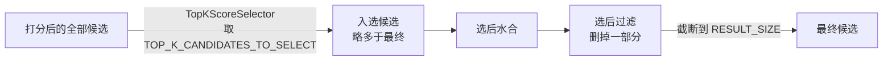
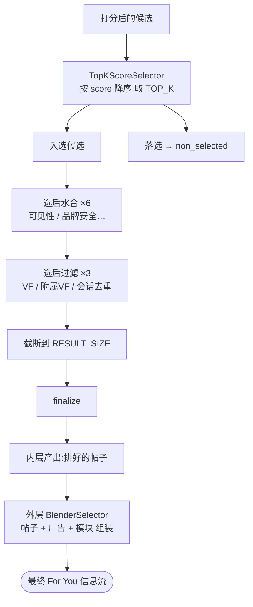

# 候选选择与成型

## 这一页回答什么

候选打完分之后,系统怎么从一大堆带分候选里选出最终展示的几十条 —— 即流水线的**选择阶段**及其之后的成型步骤。打分见 [[scoring-and-ranking]],本页接着往下走。

## 核心结论

1. **选择 = 排序 + 截断**。`Selector` trait 的默认 `select()` 就是"按分降序排 → 截断到 `size()`"。
2. **两个选择器**:内层 `TopKScoreSelector`(按 `score` 取 top-K);外层 `BlenderSelector`(把 `FeedItem` 组装成最终信息流)。
3. **选择不是终点**:选完还有选后水合 → 选后过滤 → 截断到 `RESULT_SIZE`。所以内层"选 top-K"刻意选得**比最终条数多**,留出余量给选后过滤删。
4. **落选候选不丢弃**:进入 `non_selected`,供 side effect 与调试使用。

## Selector:排序 + 截断的骨架

`Selector` trait(`candidate-pipeline/selector.rs:21-85`)把"选择"抽象成可复用骨架,默认 `select()` 已实现:

```rust
// candidate-pipeline/selector.rs:47-61
fn select(&self, _query: &Q, candidates: Vec<C>) -> SelectResult<C> {
    let mut sorted = self.sort(candidates);          // 按分降序
    if let Some(limit) = self.size() {
        let non_selected = sorted.split_off(limit.min(sorted.len()));  // 截断
        SelectResult { selected: sorted, non_selected }
    } else {
        SelectResult { selected: sorted, non_selected: vec![] }
    }
}
```

- `sort()`(`:67-75`):按 `score()` 降序,`partial_cmp` 失败(`NaN`)兜底为相等。
- `score()`:抽象方法,业务实现 —— 从候选里取出用于排序的分。
- `size()`(`:78-80`):默认 `None`(不截断);override 返回 `Some(limit)` 则 `split_off` 出落选部分。
- 结果 `SelectResult { selected, non_selected }`(`:6-9`):选中的进下一阶段,落选的单独留存。

业务**最少只需实现 `score()` 一个方法**,排序与截断由框架包办。详见 [[candidate-pipeline-framework]]。

## TopKScoreSelector:内层选择器

内层 `PhoenixCandidatePipeline` 的选择器,实现极简(`home-mixer/selectors/top_k_score_selector.rs`):

```rust
// home-mixer/selectors/top_k_score_selector.rs:8-15
impl Selector<ScoredPostsQuery, PostCandidate> for TopKScoreSelector {
    fn score(&self, candidate: &PostCandidate) -> f64 {
        candidate.score.unwrap_or(f64::NEG_INFINITY)
    }
    fn size(&self) -> Option<usize> {
        Some(params::TOP_K_CANDIDATES_TO_SELECT)
    }
}
```

它只 override `score()`(取候选的最终分 `score` —— 由 [[scoring-and-ranking|RankingScorer]] 写入;无分的候选取负无穷,排到最后)和 `size()`(`params::TOP_K_CANDIDATES_TO_SELECT`)。`select()` 用默认实现 —— 于是行为就是:**按最终分降序排,取前 `TOP_K_CANDIDATES_TO_SELECT` 个**。

## 选完之后:水合 → 过滤 → 截断

选择只是流水线第 ⑦ 阶段。`execute()` 在它之后还有三步(`candidate-pipeline/candidate_pipeline.rs:102-119`):

```rust
// candidate-pipeline/candidate_pipeline.rs:102-119(节选)
let SelectResult { selected, non_selected } = self.select(&query, scored);
let post_hydrated = self.hydrate_post_selection(&query, selected).await;   // ⑧
let (mut final_candidates, post_filtered) =
    self.filter_post_selection(&query, post_hydrated);                      // ⑨
let truncated = final_candidates.split_off(self.result_size().min(final_candidates.len()));
non_selected.extend(truncated);                                             // 截断
self.finalize(&query, &mut final_candidates);
```

| 步骤 | 内容 | 为什么放选择之后 |
|------|------|------|
| **选后水合** | 6 个 hydrator:`VFCandidateHydrator`、`AdsBrandSafetyHydrator`、`AdsBrandSafetyVfHydrator`、`TweetTypeMetricsHydrator`、`FollowingRepliedUsersHydrator`、`MutualFollowJaccardHydrator`(`phoenix_candidate_pipeline.rs:304-315`) | 可见性、品牌安全等数据获取昂贵,**只对会展示的入选候选**做,省成本 |
| **选后过滤** | 3 个 filter:`VFFilter`、`AncillaryVFFilter`、`DedupConversationFilter`(`:317-321`) | 依赖选后水合刚拿到的可见性数据;会话去重也要在最终集合上做。详见 [[filtering-pipeline]] |
| **截断** | `split_off(result_size())` —— 砍到 `params::RESULT_SIZE`,多出的并入 `non_selected` | 选后过滤删掉一些后,再砍到最终条数 |
| **finalize** | `finalize()` 钩子(默认空) | 给业务对最终列表做最后调整的口子 |

### 为什么有两个数量上限

选择阶段取 `TOP_K_CANDIDATES_TO_SELECT` 个,最后又截断到 `RESULT_SIZE` —— 两个限制刻意不同:



内层先选**略多**的 top-K,留出余量;经选后过滤删掉一些不可见/重复的之后,再砍到最终的 `RESULT_SIZE`。若一开始就只选 `RESULT_SIZE` 个,选后过滤一删就不够数了。

## BlenderSelector:外层选择器与最终成型

外层 [[home-mixer-orchestration|ForYouCandidatePipeline]] 的选择器是 `BlenderSelector`(`home-mixer/selectors/blender_selector.rs:24-75`)。它的候选类型是 `FeedItem`(帖子 / 广告 / Who-to-Follow / Prompt / PushToHome 的 oneof),做的不是"按分截断"而是**组装**:

1. `partition_feed_items` 把 `FeedItem` 按类型分桶(`:141-164`)
2. 按 `AdsBlenderType` 参数选广告 blender,`blend()` 把帖子与广告混排
3. `insert_prompts` 插到 `PROMPTS_POSITION`、`insert_who_to_follow` 插到 `WHO_TO_FOLLOW_POSITION`、`pin_push_to_home` 钉在位置 0

广告混排的细节见 [[ads-blending]]。外层的结果规模是 `params::FOR_YOU_MAX_RESULT_SIZE`。

> 注意 `BlenderSelector::score()` 直接返回 `0.0` —— 它不靠分数排序,帖子的顺序在内层 `TopKScoreSelector` 时就定了,外层只负责把广告 / 模块编排进去。

## 完整选择链



## 设计决策

| 决策 | 选择 | 理由 |
|------|------|------|
| 选择抽象 | `Selector` trait + 默认 `select()` | 排序 + 截断是通用逻辑,业务通常只填 `score()` |
| 内层选择器 | `TopKScoreSelector` 纯按最终分 | 帖子顺序只由相关性分决定,简单可预期 |
| 三段式收尾 | 选 top-K(多)→ 选后过滤 → 截断到 `RESULT_SIZE` | 留余量:过滤会删人,先多选才不会最后不够数 |
| 昂贵水合后置 | 可见性 / 品牌安全水合放选择之后 | 只对会展示的入选候选做,不为落选候选白花成本 |
| 落选不丢 | 进 `non_selected` | 可供 side effect 记录、调试归因 |
| 内外选择器分工 | 内层按分截断,外层只组装 | 相关性排序与广告 / 模块编排是两件事,分开 |

## FAQ

**Q:`TopKScoreSelector` 的 `TOP_K_CANDIDATES_TO_SELECT` 和最终 `RESULT_SIZE` 哪个大?**
A:`TOP_K_CANDIDATES_TO_SELECT` ≥ `RESULT_SIZE`。先选略多,经选后过滤删减后再截断到 `RESULT_SIZE`。两者都是 feature switch 参数。

**Q:选后过滤为什么不直接在打分前那道过滤里做?**
A:`VFFilter` 等依赖 `VFCandidateHydrator` 在**选择之后**才获取的可见性数据;而这类数据获取昂贵,只值得对入选候选做。`DedupConversationFilter`(会话去重)也需要在接近最终的集合上做才有意义。

**Q:落选的候选去哪了?**
A:进入 `SelectResult.non_selected`,以及被截断的部分也并入 `non_selected`。它们最终进 `PipelineResult.filtered_candidates` / 传给 side effect,不展示但保留,用于日志与调试。

## 源码锚点

- `candidate-pipeline/selector.rs:21-85` —— `Selector` trait 与默认 `select()`/`sort()`
- `candidate-pipeline/selector.rs:6-19` —— `SelectResult`
- `candidate-pipeline/candidate_pipeline.rs:102-119` —— `execute()` 中选择 + 选后 + 截断
- `home-mixer/selectors/top_k_score_selector.rs:8-15` —— `TopKScoreSelector`
- `home-mixer/selectors/blender_selector.rs:24-75` —— `BlenderSelector`
- `home-mixer/candidate_pipeline/phoenix_candidate_pipeline.rs:302-321` —— 选择器、选后水合、选后过滤的装配

## 相关页面

- [[scoring-and-ranking]] —— 上游:候选的最终分怎么算出来
- [[filtering-pipeline]] —— 选后过滤的 3 个过滤器细节
- [[ads-blending]] —— 外层 `BlenderSelector` 的广告混排细节
- [[candidate-pipeline]] —— `execute()` 十阶段编排,选择是第 ⑦ 阶段
- [[candidate-pipeline-framework]] —— `Selector` trait 在框架中的位置
- [[home-mixer-orchestration]] —— 内 / 外两条流水线各自的选择器
- [[how-posts-are-picked]] —— 本页的白话版
- [[system-architecture]] —— 选择在整体流水线中的位置
