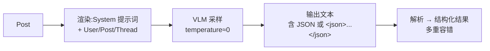

# Grox 内容分类器

## 这一页回答什么

Grox 用哪些分类器理解帖子内容(垃圾、安全、质量、回复价值),它们共同的结构,以及各自背后的模型与输出。

## 核心结论

1. **分类器全部基于 VLM**:每个分类器用一个视觉语言模型(`VisionSampler` + Grok 模型),温度≈0。
2. **统一三段式**:`ContentClassifier` 把分类抽象成 `_to_convo`(渲染成对话)→ `_sample`(VLM 采样)→ `_parse`(解析 JSON)。
3. **覆盖四类判断**:垃圾检测、安全/PTOS、帖子质量("banger")、回复打分。
4. **输出结构化**:VLM 被要求输出 JSON(常包在 `<json>...</json>` 里),解析成 `ContentCategoryResult` 等。

## 统一基类 ContentClassifier

`ContentClassifier`(`classifier.py:19`)定义所有分类器的骨架:

```python
class ContentClassifier(ABC):
    def __init__(self, categories: list[ContentCategoryType], llm: LiteLLM): ...

    async def _classify(self, post: Post) -> list[ContentCategoryResult]:
        convo  = await self._to_convo(post)   # 1. 把帖子渲染成对话
        output = await self._sample(convo)    # 2. VLM 采样
        return await self._parse(post, output)  # 3. 解析成结构化结果
```

`classify()` 在三段外包了请求/成功/错误计数与延迟直方图。`_to_convo` / `_sample` / `_parse` 由各子类实现。

所有分类器构造时都从 `grox_config` 取一个模型并把 `temperature` 设成 `0.000001`(近似贪心解码,保证可复现):

```python
vlm_config = grox_config.get_model(ModelName.VLM_PRIMARY)
vlm_config.temperature = 0.000001
vlm = VisionSampler(GrokModelConfig(**vlm_config.model_dump()))
```

## 垃圾检测

`SpamEapiLowFollowerClassifier`(`spam.py:25`):

- 模型:`VLM_PRIMARY`;类别:`SPAM_COMMENT`
- `_to_convo`:系统提示 `SpamSystemLowFollower`,再用 `ThreadRenderer` 把帖子线程渲进对话
- `_parse`:解析 `SpamSampleResult` JSON 取 `decision`;失败则用正则兜底抓 `"decision"`。`decision == "spam"` → `positive=True, score=1.0`,否则 `0.0`

从类名看,这是针对**低粉丝用户**评论的垃圾筛查。

## 安全 / PTOS

`safety_ptos.py` 有两个分类器,都服务 `SAFETY_PTOS` 类别。

### SafetyPtosCategoryClassifier

`safety_ptos.py:57`。判定帖子**违反了哪些安全策略类别**:

- 模型:`VLM_SAFETY`
- `deluxe` 模式:系统提示用去掉"思考限制"的 `SafetyPtos` 变体,并留空 assistant 消息让模型自由推理
- 输出:`(.*)<json>(.*)</json>` 正则抓 JSON → `SafetyPostAnnotations`

### SafetyPtosPolicyClassifier

`safety_ptos.py:140`。针对**单条具体违规**做策略级判定:

- 模型:`VLM_PRIMARY_CRITICAL`
- 按违规类别选对应策略提示词,支持 **7 个策略类别**(`SUPPORTED_POLICY_CATEGORIES`,`safety_ptos.py:217-225`):

| 策略类别 | 提示词 |
|----------|--------|
| `ViolentMedia` | `ViolentMediaPolicy` |
| `AdultContent` | `AdultContentPolicy` |
| `Spam` | `SpamPolicy` |
| `IllegalAndRegulatedBehaviors` | `IllegalAndRegulatedBehaviorsPolicy` |
| `HateOrAbuse` | `HateOrAbusePolicy` |
| `ViolentSpeech` | `ViolentSpeechPolicy` |
| `SuicideOrSelfHarm` | `SuicideOrSelfHarmPolicy` |

- `deluxe` 模式下,对 `DELUXE_4_2_CATEGORIES`(`AdultContent`、`ViolentMedia`)走 EAPI 推理采样器(`EAPI_REASONING` / `EAPI_REASONING_INTERNAL`),失败回退到 VLM(`safety_ptos.py:269-280`)
- 输出 `<json>` → `SafetyPolicy`

## 帖子安全 Deluxe 筛查

`PostSafetyDeluxeClassifier`(`post_safety_screen_deluxe.py:32`):

- 模型:`VLM_PRIMARY_CRITICAL`;类别:`POST_SAFETY_SCREEN`
- 系统提示 `PostSafetyDeluxe`,渲染用户 + 帖子
- 输出 `<json>` → `PostSafetyScreenResult`,核心是 `tweet_bool_metadata`(一组布尔元数据)

## 帖子质量初筛(Banger)

`BangerInitialScreenClassifier`(`banger_initial_screen.py:41`):

- 模型:`VLM_PRIMARY`;类别:`BANGER_INITIAL_SCREEN`、`GROK_RANKER`
- 系统提示 `BangerMiniVlmScreenScore`(可带 `topics` 参数)
- 输出 `<json>` → `BangerInitialScreenResult`:

```python
class BangerInitialScreenResult(BaseModel):
    quality_score: float
    description: str
    tags: list[str]
    taxonomy_categories: list[dict] | None
    tweet_bool_metadata: TweetBoolMetadata | None
    slop_score: int | None
    has_minor_score: float | None
```

`_parse`(`banger_initial_screen.py:102-160`):取 `quality_score`,记 0–1 的直方图,**`score >= 0.4` 判为 positive**;还提取 `<json>` 之前的文本作为模型的推理过程(`reasoning`),以及话题分类(`taxonomy_categories`)、标签等。

## 回复打分

`ReplyScorer`(`reply_ranking.py:26`)—— 注意它**不是** `ContentClassifier` 子类,是独立类:

- 主模型 `VLM_MINI_CRITICAL`,回退模型 `VLM_PRIMARY_CRITICAL`
- 系统提示 `ReplyScoringSystem`;用 `ThreadRenderer` 渲染线程并 `include_signals=True`(带互动信号)
- `_sample`:先用主模型 + JSON schema 采样;若输出里没有合法 `score` → 用回退模型重采(非推理模式)
- `_parse`:多重容错 —— Pydantic 校验失败则用 `json_repair` 修复,再失败用正则抓 `"score"`
- 输出 `ReplyScoreResult(score, reason)`,`score` 落在 0–3 的直方图桶

## 共同模式



| 分类器 | 模型 | 输出类型 |
|--------|------|---------|
| `SpamEapiLowFollowerClassifier` | `VLM_PRIMARY` | `ContentCategoryResult`(spam 决策) |
| `SafetyPtosCategoryClassifier` | `VLM_SAFETY` | `SafetyPostAnnotations` |
| `SafetyPtosPolicyClassifier` | `VLM_PRIMARY_CRITICAL`(+EAPI 推理) | `SafetyPolicy` |
| `PostSafetyDeluxeClassifier` | `VLM_PRIMARY_CRITICAL` | `PostSafetyScreenResult` |
| `BangerInitialScreenClassifier` | `VLM_PRIMARY` | `BangerInitialScreenResult` |
| `ReplyScorer` | `VLM_MINI_CRITICAL`(回退 `VLM_PRIMARY_CRITICAL`) | `ReplyScoreResult` |

## 设计决策

| 决策 | 选择 | 理由 |
|------|------|------|
| 用 VLM 做分类 | 替代传统专用分类模型 | 一个多模态大模型 + 不同提示词即可覆盖多种内容判断,省去逐任务建模 |
| 温度≈0 | `temperature = 0.000001` | 近似贪心解码,判定可复现、可缓存 |
| `<json>` 包裹输出 | 正则抓 `<json>...</json>` | 把模型的自由推理与结构化结论分开,推理可留作 `reason` |
| 解析多重容错 | Pydantic → `json_repair` → 正则 | LLM 输出 JSON 偶有瑕疵,逐级降级保证尽量取到结果 |
| 关键任务用 critical 模型 | 安全/回复用 `*_CRITICAL` 变体 | 安全判定与回复排序对质量更敏感 |
| deluxe 模式 | 启用推理 / EAPI 推理模型 | 复杂安全判定需要更强的推理,普通模式更省成本 |

## FAQ

**Q:这些分类器和 [[ads-blending|品牌安全]]裁定什么关系?**
A:分类器产出的安全标签/注解写入下游存储;`home-mixer` 侧的 `compute_verdict` 再据此(含是否被 Grok 评分、是否 PTOS 审过)算出 `BrandSafetyVerdict`。Grox 是上游标注方。

**Q:"banger" 是什么?**
A:指高质量、可能爆款的帖子。`BangerInitialScreenClassifier` 给帖子打质量分(0–1),`>= 0.4` 视为通过初筛,供下游排序参考。

## 源码锚点

- `grox/classifiers/content/classifier.py:83-98` —— `_to_convo`/`_sample`/`_parse` 三段抽象
- `grox/classifiers/content/safety_ptos.py:217-225` —— 7 个安全策略类别
- `grox/classifiers/content/banger_initial_screen.py:102-160` —— banger 评分解析
- `grox/classifiers/content/reply_ranking.py:74-158` —— 回复打分的回退与容错

## 相关页面

- [[grox-architecture]] —— 分类器在 Plan/Task 体系中的执行
- [[multimodal-embedders]] —— Grox 的另一类产出:内容嵌入
- [[ads-blending]] —— 消费安全标签的下游
- [[filtering-pipeline]] —— 使用可见性/安全结果的过滤器
