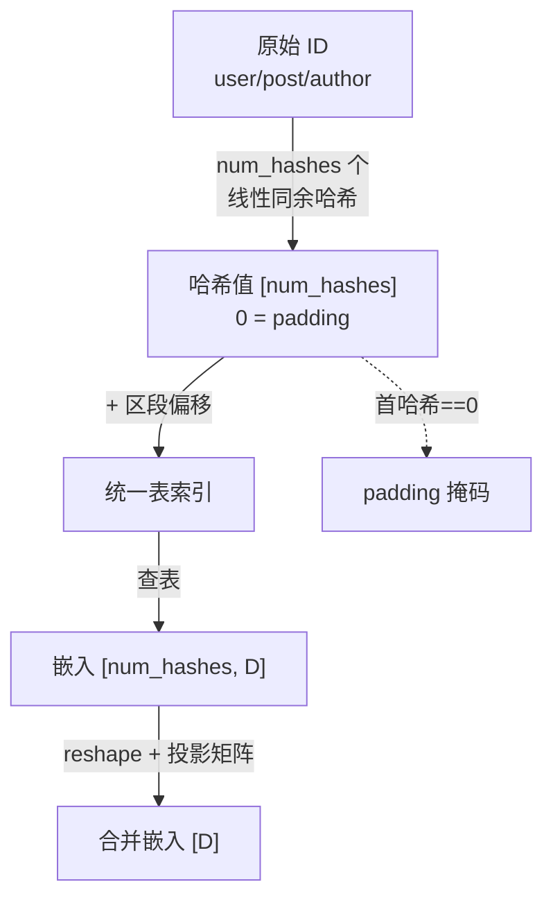

# 哈希嵌入

## 这一页回答什么

Phoenix 模型如何用哈希把任意用户/帖子/作者 ID 映射进固定大小的嵌入表,以及多个哈希值如何合并成一个 D 维表示。

## 核心结论

1. **ID 不直接做嵌入索引**:每个 ID 经多个哈希函数(默认 2 个)映射进固定容量的桶。
2. **三类实体共用一张大表**:用户/帖/作者嵌入按偏移区段拼在一张单一嵌入表里。
3. **哈希值 0 保留给 padding**:无效/填充位的哈希恒为 0。
4. **多哈希结果靠投影合并**:`block_*_reduce` 把 `num_hashes` 个嵌入拼接后投影回 D 维。

## 为什么用哈希

用户、帖子、作者的 ID 空间是开放且巨大的(数十亿且持续增长)。给每个 ID 一行嵌入不现实。哈希嵌入把无界 ID 空间压进固定容量的嵌入表(`user_vocab_size` / `item_vocab_size` / `author_vocab_size`,mini 版各 100 万)。

代价是**哈希碰撞** —— 不同 ID 可能落进同一桶。缓解办法是**每个实体用多个独立哈希函数**:两个 ID 同时在所有哈希函数上都碰撞的概率极低,合并多个哈希嵌入后,单次碰撞的影响被摊薄。

## 哈希函数

`_hash_ids`(`run_pipeline.py:76-90`)是线性同余哈希 —— 即"ID 乘一个常数、加一个常数、再取模",一种极快的整数散列方式:

```python
def _hash_ids(ids, scales, biases, modulus, num_buckets):
    ids = np.asarray(ids, dtype=np.int64).ravel()
    out = np.empty((len(ids), len(scales)), dtype=np.int32)
    for i in range(len(ids)):
        for j in range(len(scales)):           # j 遍历每个哈希函数
            raw = (ids[i] * scales[j] + biases[j]) % np.int64(modulus)
            out[i, j] = 0 if ids[i] == 0 else int((int(raw) % (num_buckets - 1)) + 1)
    return out
```

- 每个实体类型有一组 `scales` / `biases`(数组长度 = 哈希函数个数)和一个 `modulus`,来自导出的 `config.json` 的 `hash_params`。
- `ids[i] == 0` → 哈希恒为 **0**,这是 padding/无效位的保留值。
- 否则结果落在 `[1, num_buckets-1]`。
- 用 numpy int64 回绕算术,与训练时一致。

## 统一嵌入表

`build_hash_functions`(`run_pipeline.py:93-115`)把三类实体哈希到同一张大表的不同区段。`pad = 65`:

```python
def hash_user(user_ids):   # 用户区段
    h = _hash_ids(user_ids, ..., uv)
    return np.where(h == 0, 0, h + pad)
def hash_item(item_ids):   # 帖子区段
    h = _hash_ids(item_ids, ..., iv)
    return np.where(h == 0, 0, h + pad + uv)
def hash_author(author_ids):  # 作者区段
    h = _hash_ids(author_ids, ..., av)
    return np.where(h == 0, 0, h + pad + uv + iv)
```

`build_unified_emb_table`(`run_pipeline.py:118-129`)拼出形状 `[pad + uv + iv + av, emb_size]` 的单表:

```
索引区段:
┌──────────┬─────────────┬─────────────┬──────────────┐
│ [0, 65)  │ [65, 65+uv) │ ...item...  │ ...author... │
│  pad     │  用户嵌入    │  帖子嵌入    │  作者嵌入     │
└──────────┴─────────────┴─────────────┴──────────────┘
```

`pad` 段在最前,哈希 0 落在这里 —— 因此 padding 位查到的是 pad 区的嵌入,并在掩码中被标为无效。

## 多少个哈希

`HashConfig`(`recsys_model.py:93-101`):

```python
@dataclass
class HashConfig:
    num_user_hashes: int = 2
    num_item_hashes: int = 2
    num_author_hashes: int = 2
    num_ip_hashes: int = 0
```

每个用户/帖/作者默认用 **2** 个哈希函数;IP 默认关闭。一个 ID 因此查到 `num_hashes` 个嵌入,形状 `[..., num_hashes, D]`。

## 多哈希嵌入如何合并

查表后的多哈希嵌入由 `block_*_reduce` 合并(`recsys_model.py:147-332`)。以用户为例(`block_user_reduce`):

```python
# user_embeddings: [B, num_user_hashes, D]
user_embedding = user_embeddings.reshape((B, 1, num_user_hashes * D))   # 拼接
proj_mat_1 = hk.get_parameter("proj_mat_1", [num_user_hashes * D, D], ...)
user_embedding = jnp.dot(user_embedding, proj_mat_1)                     # 投影回 D
```

`num_hashes` 个嵌入沿特征维拼成 `num_hashes*D`,再经一个学习的投影矩阵压回 `D`。历史段 `block_history_reduce` 与候选段 `block_candidate_reduce` 同理,只是拼接的成分更多(帖+作者+动作+产品面等,见 [[phoenix-ranking]])。

padding 掩码统一由"首个哈希是否为 0"决定(`recsys_model.py:195,266,330`):

```python
user_padding_mask = (user_hashes[:, 0] != 0).reshape(B, 1)
```

## 数据流



## 设计决策

| 决策 | 选择 | 理由 |
|------|------|------|
| 哈希而非直接索引 | 无界 ID → 固定容量桶 | 用户/帖 ID 无上界且持续增长,直接嵌入表不可行 |
| 每实体多哈希 | 默认 2 个独立哈希函数 | 摊薄单次碰撞影响 —— 两 ID 在所有哈希上都撞的概率极低 |
| 统一大表 + 区段偏移 | 用户/帖/作者拼一张表 | 单次查表即可,省去多表管理;`pad` 段隔离 padding |
| 哈希 0 保留 | `id==0 → hash 0` | 用同一值统一表示 padding/无效,掩码判定简单 |
| 多哈希靠投影合并 | 拼接后过 `proj_mat` | 投影是学习的,可自适应地融合多个哈希视角 |

## FAQ

**Q:碰撞了会怎样?**
A:两个 ID 落进同一桶就共享一行嵌入。但每个实体用 2 个独立哈希,合并后等价于一个组合键;两 ID 在两个哈希上都碰撞才会完全混淆,概率约为单次碰撞率的平方。

**Q:召回和排序的哈希一样吗?**
A:`run_pipeline.py` 为 retrieval 与 ranker **各自**用其 `config.json` 里的 `hash_params` 构建哈希函数(`run_pipeline.py:226-227`),两者参数独立,因为两个模型有各自的嵌入表。

## 源码锚点

- `phoenix/run_pipeline.py:76-90` —— `_hash_ids` 线性同余哈希
- `phoenix/run_pipeline.py:93-115` —— `build_hash_functions` 区段偏移
- `phoenix/run_pipeline.py:118-129` —— `build_unified_emb_table` 统一表
- `phoenix/recsys_model.py:93-101` —— `HashConfig`
- `phoenix/recsys_model.py:147-197` —— `block_user_reduce` 多哈希合并

## 相关页面

- [[phoenix-ranking]] —— 哈希嵌入喂给排序模型的三段输入
- [[phoenix-retrieval]] —— 召回模型同样使用哈希嵌入
- [[recsys-model]] —— `block_*_reduce` 与 `HashConfig` 所在
- [[run-pipeline]] —— 端到端脚本里如何重建哈希函数与嵌入表
