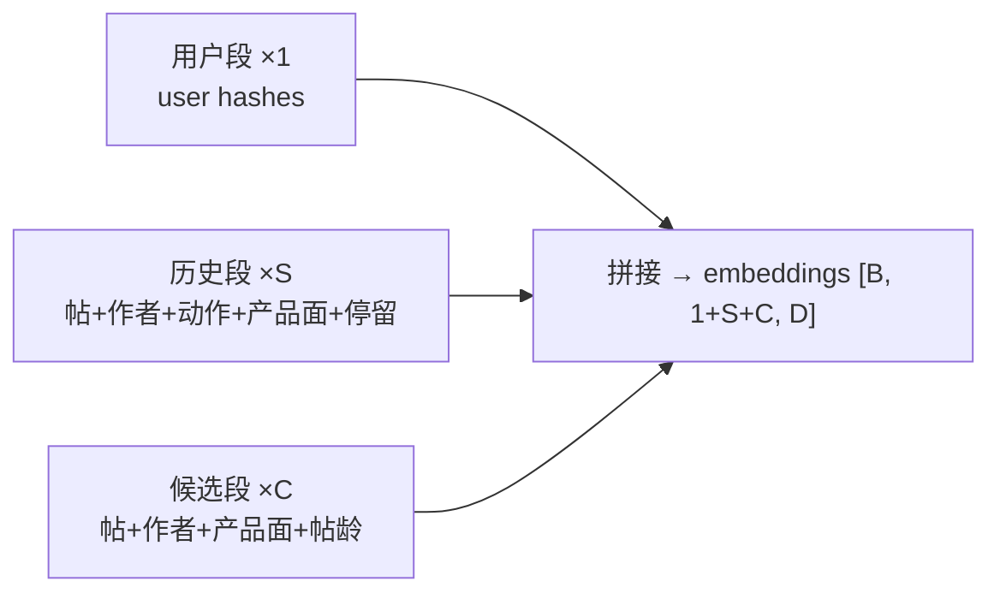

# Phoenix 排序模型

## 这一页回答什么

Phoenix 排序模型如何把"用户 + 互动历史 + 候选帖"编码成一条序列、过 Grok transformer、再为每条候选输出多种互动概率。

## 核心结论

1. **一条序列编码三段**:`[用户(1) | 历史(S) | 候选(C)]` 拼成单一 transformer 输入。
2. **候选互相隔离**:特殊注意力掩码让候选只能注意用户与历史,不能注意彼此 —— 详见 [[candidate-isolation-masking]]。
3. **多行为预测**:每条候选输出 `num_actions` 个离散互动 logit + `num_continuous_actions` 个连续值预测(默认 8)。
4. **历史是带动作的序列**:历史里每个帖子都附带"用户对它做了哪些动作"和停留时长,这是模型学相关性的信号源。

## 输入:三段拼成一条序列

`PhoenixModel.build_inputs()`(`recsys_model.py:520-626`)构造长度为 `1 + S + C` 的序列:



三段各自先经一个 `block_*_reduce` 把多哈希嵌入压成 D 维(见 [[hash-based-embeddings]]):

| 段 | reduce 函数 | 拼接的成分 |
|----|------------|-----------|
| 用户 | `block_user_reduce` | 用户哈希嵌入(+ 可选 IP) |
| 历史 | `block_history_reduce` | 帖嵌入 + 作者嵌入 + **动作嵌入** + 产品面嵌入 + 停留时长嵌入 |
| 候选 | `block_candidate_reduce` | 帖嵌入 + 作者嵌入 + 产品面嵌入 + **帖龄嵌入** |

`candidate_start_offset = 1 + S` —— 候选段的起始位置,后面注意力掩码与输出抽取都靠它。

### 动作嵌入:历史的核心信号

历史里每个帖子附一个多热(multi-hot)动作向量,经 `_get_action_embeddings()`(`recsys_model.py:404-432`)编码:

```python
actions_signed = (2 * actions - 1).astype(jnp.float32)   # {0,1} → {-1,+1}
action_emb = jnp.dot(actions_signed, action_projection)   # [num_actions, D] 投影
```

把 0/1 映射成 ±1 再投影 —— 模型既知道用户"做了什么"也知道"没做什么"。这是"零手工特征"理念的落点:相关性不靠人工特征,靠这条带动作的互动序列学出来。

### 帖龄分桶

候选帖按曝光时间与创建时间的差做分桶(`compute_post_age_bucket`,`recsys_model.py:36-55`):粒度 `post_age_granularity_mins`(默认 60 分钟),上限 `POST_AGE_MAX_MINUTES = 4800`,加溢出桶与缺失桶,共 `post_age_vocab_size = 4800/60 + 2 = 82` 个桶。

## transformer 与输出

`PhoenixModel.__call__()`(`recsys_model.py:628-680`):

```python
embeddings, padding_mask, candidate_start_offset = self.build_inputs(batch, recsys_embeddings)
model_output = self.model(embeddings, padding_mask,
                          candidate_start_offset=candidate_start_offset, positions=positions)
out_embeddings = layer_norm(model_output.embeddings)
candidate_embeddings = out_embeddings[:, candidate_start_offset:, :]   # 只取候选段
logits = candidate_embeddings @ unembeddings                           # [B, C, num_actions]
continuous_preds = sigmoid(candidate_embeddings @ continuous_unembeddings)  # [B, C, num_continuous]
```

要点:

- transformer 是移植自 Grok-1 的 [[grok-transformer]],`candidate_start_offset` 传进去用于构造 [[candidate-isolation-masking|候选隔离掩码]]。
- 输出只抽取**候选段**的位置(`out_embeddings[:, candidate_start_offset:, :]`)—— 用户段、历史段的输出不直接用。
- 两个输出头:
  - **离散头** `unembeddings` [D, num_actions] → `logits` [B, C, num_actions],对应点赞/回复/转发/点击等离散互动。
  - **连续头** `continuous_unembeddings` [D, num_continuous_actions] → sigmoid → `continuous_preds` [B, C, num_continuous],默认 `num_continuous_actions = 8`(如停留时长)。
- 若 `right_anchored_rope` 开启,用 `right_anchored_rope_positions` 把最新历史 token 锚定到固定位置(见 [[grok-transformer]])。

`num_actions` 是配置项,不写死。据 `phoenix/README.md` 的 mini 模型配置表,公开 checkpoint 的动作类型数为 **19**。

## 配置(mini checkpoint)

`PhoenixModelConfig`(`recsys_model.py:335-392`)的 dataclass 默认值与公开 mini checkpoint 实配:

| 项 | dataclass 默认 | mini checkpoint(README) |
|----|--------------|------|
| `emb_size` | (无默认) | 128 |
| transformer 层数 | —— | 4 |
| 注意力头数 | —— | 4 |
| `history_seq_len` | 128 | 127 |
| `candidate_seq_len` | 32 | 64 |
| `num_actions` | (无默认) | 19 |
| `num_continuous_actions` | 8 | —— |
| `product_surface_vocab_size` | 16 | —— |
| 每实体哈希数 | `HashConfig`:user/item/author 各 2 | 2 |

> 注:顶层 `README.md` 与 `phoenix/README.md` 对 mini 模型尺寸描述不一致(前者写 256-dim/2-layer,后者写 128-dim/4-layer)。`phoenix/README.md` 的配置表与代码默认更接近,本页以其为准。

## 设计决策

| 决策 | 选择 | 理由 |
|------|------|------|
| 三段拼一条序列 | user / history / candidate 同一 transformer | 候选能直接注意用户与历史,无需双塔交互层 |
| 候选隔离 | 掩码禁止候选互相注意 | 单条候选得分不依赖同批其它候选 → 分数稳定、可缓存(见 [[candidate-isolation-masking]]) |
| 动作 ±1 编码 | `2*actions-1` 而非 0/1 | 让"未发生的动作"也成为负向信号,而非被零掩没 |
| 双输出头 | 离散 logits + 连续 sigmoid | 点赞/转发是二元事件,停留时长是连续量,分头建模 |
| 只取候选段输出 | `out[:, candidate_start_offset:]` | 用户/历史段只作上下文,预测目标是候选 |

## FAQ

**Q:排序模型和召回模型什么关系?**
A:[[phoenix-retrieval|召回模型]]的用户塔复用同一套 Grok transformer 与 `block_user_reduce`/`block_history_reduce`。区别:召回只编码 user+history 再 mean-pool 成一个向量做近邻搜索;排序把候选也拼进序列,逐候选出多行为 logit。

**Q:logits 怎么变成最终排序分?**
A:排序模型只输出每条候选的多行为 logit;`home-mixer` 的 `RankingScorer` 再对这些概率加权求和,见 [[scoring-and-ranking]]。

## 源码锚点

- `phoenix/recsys_model.py:520-626` —— `build_inputs` 构造三段序列
- `phoenix/recsys_model.py:628-680` —— `__call__` transformer 前向与双头输出
- `phoenix/recsys_model.py:404-432` —— `_get_action_embeddings` 动作编码
- `phoenix/recsys_model.py:335-392` —— `PhoenixModelConfig`

## 相关页面

- [[recsys-model]] —— 排序模型的代码构件细节
- [[candidate-isolation-masking]] —— 候选隔离注意力掩码
- [[grok-transformer]] —— 底层 transformer 骨架
- [[hash-based-embeddings]] —— 三段输入的哈希嵌入
- [[phoenix-retrieval]] —— 召回模型(共用 transformer)
- [[scoring-and-ranking]] —— logits 如何加权成最终分
