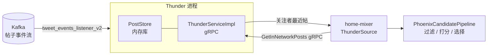
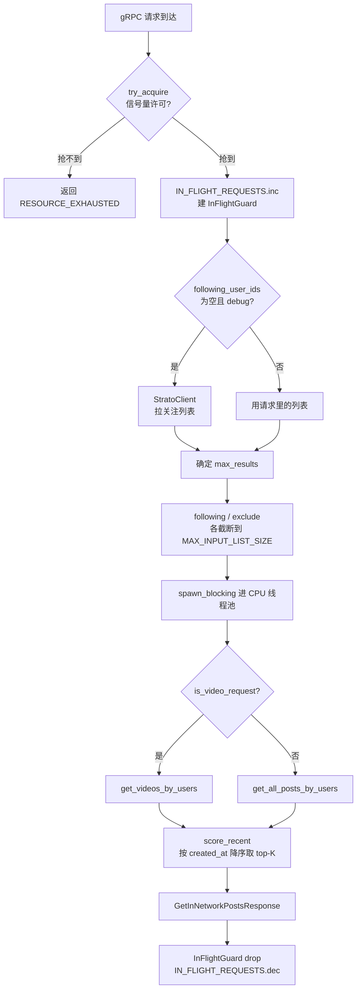
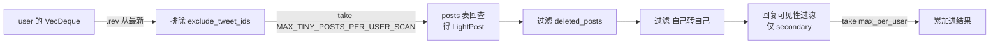

# Thunder 站内帖子内存库

## 这一页回答什么

X "For You" 信息流里"关注的人发的帖"这一路候选(in-network)从哪来。答案是 **Thunder** —— 一个用 Rust 写的进程内内存库,从 Kafka 实时消费帖子事件,把最近若干天的帖子按作者组织在内存里,对外用 gRPC 暴露一个查询:"给我这批用户最近发的帖"。它是 [[candidate-pipeline-framework|候选流水线]] 内层 `ThunderSource` 背后的服务。

这一页讲 **服务一侧**:内存数据结构、查询路径、时效打分、限流。实时摄入(Kafka 两个 listener、反序列化、保留期 trim)见 [[thunder-kafka-ingestion]];`PostStore` 结构体本身的字段与方法清单见 [[post-store]]。

## 核心结论

1. **三套时间线 + 一份正文**:每个用户的帖子被拆进三个独立的 per-user 队列 —— 原创帖、回复/转发、视频帖;帖子正文只存一份(`posts: DashMap<i64, LightPost>`),三个队列里只放 `TinyPost`(id + 时间戳)引用。一条视频原创帖会同时出现在原创队列和视频队列。
2. **按关注列表服务候选**:`get_in_network_posts` gRPC 收到 `(请求者 user_id, 关注的 user_ids, 排除的 tweet_ids)`,对每个被关注用户取其队列尾部(最新)若干条,做 light-doc 回查得到完整 `LightPost`,过滤已删除/已见,再合并。
3. **按时效打分**:Thunder 不做 ML,排序逻辑只有一条 —— `score_recent`,按 `created_at` 降序取 top-K。真正的 ML 排序在下游 [[phoenix-ranking|Phoenix]]。
4. **全内存、亚毫秒**:数据结构是 `DashMap`(分片并发哈希表)+ `VecDeque`。查询走 `spawn_blocking` 进 CPU 线程池,不阻塞 tokio 异步运行时。
5. **信号量硬限流**:gRPC 入口用 `try_acquire` 抢信号量许可,抢不到立即返回 `RESOURCE_EXHAUSTED`,不排队。
6. **保留期内的滑动窗口**:只保留最近 `retention_seconds`(默认 2 天)的帖子,后台任务每 2 分钟 trim 一次过期帖。Thunder 因此是一个"近期帖子的滑动窗口",不是全量历史库。

## Thunder 在系统中的位置



Thunder 在请求路径上,但只承担"取站内候选"这一步。它产出的帖子进入 [[home-mixer-orchestration|home-mixer]] 流水线,与 [[phoenix-retrieval|Phoenix 召回]]的站外候选合并后统一排序。

## 进程启动:main.rs

`thunder/main.rs:16-100` 的 `main()` 是整个服务的入口,顺序如下:

```rust
// thunder/main.rs:21-46(节选)
let post_store = Arc::new(PostStore::new(
    args.post_retention_seconds,
    args.request_timeout_ms,
));
let strato_client = Arc::new(StratoClient::new());
let thunder_service = ThunderServiceImpl::new(
    Arc::clone(&post_store),
    Arc::clone(&strato_client),
    args.max_concurrent_requests,
);
let routes = Routes::new(thunder_service.server());
```

随后用 `xai_http_server::HttpServer` 把 gRPC routes 挂上,HTTP/gRPC 共用一个端口栈(`main.rs:49-60`)。关键的一段是 **Kafka catchup 门控**(`main.rs:67-90`):

```rust
// thunder/main.rs:67-93(节选)
let (tx, mut rx) = tokio::sync::mpsc::channel::<i64>(args.kafka_num_threads);
kafka_utils::start_kafka(&args, post_store.clone(), "", tx).await?;

if args.is_serving {
    // Wait for Kafka catchup signal
    let start = Instant::now();
    for _ in 0..args.kafka_num_threads {
        rx.recv().await;
    }
    info!("Kafka init took {:?}", start.elapsed());

    post_store.finalize_init().await?;

    Arc::clone(&post_store).start_stats_logger();
    Arc::clone(&post_store).start_auto_trim(2); // Run every 2 minutes
}
http_server.set_readiness(true);
```

含义:在 `is_serving` 模式下,服务**不会立刻就绪**。每个 Kafka 线程在追平历史 lag 后往 `tx` 发一个信号,`main` 收齐 `kafka_num_threads` 个信号才继续。这保证了一上线就有一份完整的近期帖子快照,而不是冷启动空库对外服务。`finalize_init` 之后才打开 readiness(`set_readiness(true)`)。catchup 信号怎么产生见 [[thunder-kafka-ingestion]]。

## 三套内存时间线

`PostStore` 的核心是四个 `DashMap`(`thunder/posts/post_store.rs:39-53`):

```rust
// thunder/posts/post_store.rs:38-53
#[derive(Clone)]
pub struct PostStore {
    /// Full post data indexed by post_id
    posts: Arc<DashMap<i64, LightPost>>,
    /// Maps user_id to a deque of TinyPost references for original posts (non-reply, non-retweet)
    original_posts_by_user: Arc<DashMap<i64, VecDeque<TinyPost>>>,
    /// Maps user_id to a deque of TinyPost references for replies and retweets
    secondary_posts_by_user: Arc<DashMap<i64, VecDeque<TinyPost>>>,
    /// Maps user_id to a deque of TinyPost references for video posts
    video_posts_by_user: Arc<DashMap<i64, VecDeque<TinyPost>>>,
    deleted_posts: Arc<DashMap<i64, bool>>,
    /// Retention period for posts in seconds
    retention_seconds: u64,
    /// Request timeout for get_posts_by_users iteration (0 = no timeout)
    request_timeout: Duration,
}
```

| 结构 | 键 | 值 | 作用 |
|------|----|----|------|
| `posts` | `post_id` | `LightPost` | 唯一一份帖子正文,三套时间线共享 |
| `original_posts_by_user` | `author_id` | `VecDeque<TinyPost>` | 该作者的**原创帖**(非回复、非转发) |
| `secondary_posts_by_user` | `author_id` | `VecDeque<TinyPost>` | 该作者的**回复 + 转发** |
| `video_posts_by_user` | `author_id` | `VecDeque<TinyPost>` | 该作者的**视频帖**(原创视频或转发了带视频的原创) |
| `deleted_posts` | `post_id` | `bool` | 删除墓碑集合(用途见 [[thunder-kafka-ingestion]]) |

**为什么拆三套**:不同候选请求要的内容不同。普通 For You 请求要原创 + 回复/转发,视频请求(`is_video_request`)只要视频帖。把视频帖单独建一份队列,视频请求就不必扫全部帖子再过滤。代价是一条视频原创帖在内存里被两个队列引用 —— 但引用的是轻量的 `TinyPost`,正文 `LightPost` 仍只有一份。

`TinyPost` 是 16 字节级别的极小结构(`post_store.rs:20-24`):

```rust
// thunder/posts/post_store.rs:19-24
#[derive(Debug, Clone, PartialEq, Eq, Hash)]
pub struct TinyPost {
    pub post_id: i64,
    pub created_at: i64,
}
```

把"时间线"和"正文"分离的好处:时间线按时间排序、按用户分组、频繁尾部追加和头部 trim,只需移动 16 字节;正文按 `post_id` 随机访问,只在回查时碰一次。`LightPost` 字段定义见 [[post-store]]。

### 入队时一条帖子归到哪些队列

`insert_posts_internal`(`post_store.rs:115-168`)对每条新帖判定:

```rust
// thunder/posts/post_store.rs:118-166(节选)
let is_original = !post.is_reply && !post.is_retweet;
// ... 去重后 ...
if is_original {
    self.original_posts_by_user.entry(author_id).or_default().push_back(tiny_post.clone());
} else {
    self.secondary_posts_by_user.entry(author_id).or_default().push_back(tiny_post.clone());
}

let mut video_eligible = post.has_video;
// 转发了一条带视频的原创 -> 也算视频帖
if !video_eligible && post.is_retweet
    && let Some(source_post_id) = post.source_post_id
    && let Some(source_post) = self.posts.get(&source_post_id)
{
    video_eligible = !source_post.is_reply && source_post.has_video;
}
if post.is_reply {
    video_eligible = false;   // 回复永远不进视频队列
}
if video_eligible {
    self.video_posts_by_user.entry(author_id).or_default().push_back(tiny_post);
}
```

三条规则值得记:
1. **原创 vs secondary 二选一**:`is_original` 为真进 `original_posts_by_user`,否则进 `secondary_posts_by_user`,互斥。
2. **视频队列是叠加的**:`video_posts_by_user` 与上面两个并列,不互斥 —— 视频原创帖会同时在原创队列和视频队列。
3. **转发带视频的原创也算视频帖**:转发本身没有 `has_video`,但若它转的源帖是带视频的原创,这条转发也进视频队列;而**回复一律不算视频帖**。

## gRPC 服务:ThunderServiceImpl

`thunder_service.rs:29-36` 定义服务:

```rust
// thunder/thunder_service.rs:29-36
pub struct ThunderServiceImpl {
    /// PostStore for retrieving posts by user ID
    post_store: Arc<PostStore>,
    /// StratoClient for fetching following lists when not provided
    strato_client: Arc<StratoClient>,
    /// Semaphore to limit concurrent requests and prevent overload
    request_semaphore: Arc<Semaphore>,
}
```

它实现 proto 生成的 `InNetworkPostsService` trait,只有一个 RPC:`get_in_network_posts`。`server()` 方法启用 Zstd 压缩(`thunder_service.rs:56-60`):

```rust
// thunder/thunder_service.rs:56-60
pub fn server(self) -> InNetworkPostsServiceServer<Self> {
    InNetworkPostsServiceServer::new(self)
        .accept_compressed(tonic::codec::CompressionEncoding::Zstd)
        .send_compressed(tonic::codec::CompressionEncoding::Zstd)
}
```

请求/响应 proto 类型来自 `xai_thunder_proto`。`GetInNetworkPostsRequest` 的字段从调用方 `home-mixer/sources/thunder_source.rs:35-43` 可完整还原:`user_id`、`following_user_ids`、`max_results`、`exclude_tweet_ids`、`algorithm`、`debug`、`is_video_request`。

## 一次 get_in_network_posts 的完整路径



### 第 1 步:信号量限流

`thunder_service.rs:160-180`:

```rust
// thunder/thunder_service.rs:158-180(节选)
let _permit = match self.request_semaphore.try_acquire() {
    Ok(permit) => {
        IN_FLIGHT_REQUESTS.inc();
        permit
    }
    Err(_) => {
        REJECTED_REQUESTS.inc();
        return Err(Status::resource_exhausted("Server at capacity, please retry"));
    }
};
// 用 guard 在请求结束时递减 in-flight 计数
struct InFlightGuard;
impl Drop for InFlightGuard {
    fn drop(&mut self) { IN_FLIGHT_REQUESTS.dec(); }
}
let _in_flight_guard = InFlightGuard;
```

关键是 `try_acquire` 而非 `acquire` —— **不排队**。在线推荐对尾延迟极敏感,排队意味着请求在队列里等到超时还是失败,不如立刻 `RESOURCE_EXHAUSTED` 让调用方走降级或重试。许可数是 `max_concurrent_requests`(构造时传入)。`InFlightGuard` 的 `Drop` 保证不论成功、出错还是 panic,`IN_FLIGHT_REQUESTS` gauge 都会准确递减。

### 第 2 步:关注列表回退

正常情况下 `following_user_ids` 由调用方([[home-mixer-orchestration|home-mixer]] 已经水合好关注图)直接带在请求里。只有当列表为空 **且** `debug` 为真时,Thunder 才自己去 `StratoClient` 拉(`thunder_service.rs:197-229`)。这是一条调试/兜底路径,生产路径不会触发 —— 多花一次 Strato RTT(`GET_IN_NETWORK_POSTS_DURATION` 与 `..._WITHOUT_STRATO` 两个计时器就是为了把这次 RTT 摘出来单独观测,`thunder_service.rs:183,236`)。

### 第 3 步:输入截断

`following_user_ids` 和 `exclude_tweet_ids` 都被截断到前 `MAX_INPUT_LIST_SIZE` 条(`thunder_service.rs:256-272`),超出会打 `warn`。这是防御性上限:一个关注了几十万人的账号不应让单次查询无限扫下去。

### 第 4 步:阻塞任务里取候选

真正的取数在 `spawn_blocking` 里(`thunder_service.rs:279-314`):

```rust
// thunder/thunder_service.rs:279-312(节选)
let proto_posts = tokio::task::spawn_blocking(move || {
    let exclude_tweet_ids: HashSet<i64> =
        exclude_tweet_ids.iter().map(|&id| id as i64).collect();
    let start_time = Instant::now();

    let all_posts: Vec<LightPost> = if req.is_video_request {
        post_store.get_videos_by_users(&following_user_ids, &exclude_tweet_ids, start_time, request_user_id)
    } else {
        post_store.get_all_posts_by_users(&following_user_ids, &exclude_tweet_ids, start_time, request_user_id)
    };
    ThunderServiceImpl::analyze_and_report_post_statistics(&all_posts, "retrieved");
    let scored_posts = score_recent(all_posts, max_results);
    ThunderServiceImpl::analyze_and_report_post_statistics(&scored_posts, "scored");
    scored_posts
}).await ...;
```

**为什么 spawn_blocking**:取候选是纯 CPU、可能扫上千个用户队列的同步循环。直接在 tokio async 任务里跑会饿死同一 worker 线程上的其它异步任务(网络 IO、其它请求)。`spawn_blocking` 把它丢到专门的阻塞线程池。`start_time` 在这里取,用于下面的 per-request 超时。`exclude_tweet_ids` 在此从 `Vec` 转成 `HashSet` 以便 O(1) 过滤。

## 服务站内候选:两条取数路径

### get_all_posts_by_users —— 普通请求

`post_store.rs:193-225`:对同一批关注用户分别查原创队列和 secondary 队列,合并:

```rust
// thunder/posts/post_store.rs:193-225(节选)
pub fn get_all_posts_by_users(&self, user_ids: &[i64], ...) -> Vec<LightPost> {
    let following_users_set: HashSet<i64> = user_ids.iter().copied().collect();

    let mut all_posts = self.get_posts_from_map(
        &self.original_posts_by_user, user_ids,
        MAX_ORIGINAL_POSTS_PER_AUTHOR,
        exclude_tweet_ids, &HashSet::new(),       // 原创:不传 following set
        start_time, request_user_id,
    );
    let secondary_posts = self.get_posts_from_map(
        &self.secondary_posts_by_user, user_ids,
        MAX_REPLY_POSTS_PER_AUTHOR,
        exclude_tweet_ids, &following_users_set,  // secondary:传 following set
        start_time, request_user_id,
    );
    all_posts.extend(secondary_posts);
    POST_STORE_POSTS_RETURNED.observe(all_posts.len() as f64);
    all_posts
}
```

注意两次调用的差异:
- 原创队列用 `MAX_ORIGINAL_POSTS_PER_AUTHOR` 做每作者上限,`following_users` 传**空集**。
- secondary 队列用 `MAX_REPLY_POSTS_PER_AUTHOR`,`following_users` 传**实际关注集** —— 这个集合非空会触发 `get_posts_from_map` 里一段额外的回复可见性过滤(见下)。

### get_videos_by_users —— 视频请求

`post_store.rs:171-190`:只查 `video_posts_by_user` 一个队列,每作者上限 `MAX_VIDEO_POSTS_PER_AUTHOR`,`following_users` 传空集(视频帖不做回复过滤)。

### get_posts_from_map —— 共用的取数核心

三套队列的取数都汇到 `get_posts_from_map`(`post_store.rs:227-328`)。它对每个 `user_id` 做这条管线:



逐段对应源码(`post_store.rs:260-318`):

```rust
// thunder/posts/post_store.rs:264-317(节选)
// 从最新往旧扫(reverse),先排掉已见的,再上扫描上限
let tiny_posts_iter = user_posts.iter().rev()
    .filter(|post| !exclude_tweet_ids.contains(&post.post_id))
    .take(MAX_TINY_POSTS_PER_USER_SCAN);

// light-doc 回查:TinyPost -> LightPost。立刻 *value() 拷出来释放读锁
let light_post_iter_1 = tiny_posts_iter
    .filter_map(|tiny_post| self.posts.get(&tiny_post.post_id).map(|r| *r.value()));

// 过滤已删除
let light_post_iter = light_post_iter_1.filter(|post| {
    if self.deleted_posts.get(&post.post_id).is_some() {
        POST_STORE_DELETED_POSTS_FILTERED.inc(); false
    } else { true }
});

// 过滤"请求者自己的帖被自己转发"
let light_post_iter = light_post_iter.filter(|post| {
    !(post.is_retweet && post.source_user_id == Some(request_user_id))
});
// ... 回复可见性过滤 ...
light_posts.extend(filtered_post_iter.take(max_per_user));
```

几个要点:

**(a) 从最新往旧扫**。`VecDeque` 尾部是最新帖(入队 `push_back`),`.iter().rev()` 即从最新开始。`MAX_TINY_POSTS_PER_USER_SCAN` 是扫描上限 —— 注释说"防止一直回溯到用户不活跃的远古时期"(`post_store.rs:265-266`)。对一个发帖很多的活跃账号,只看最近这一段就够。

**(b) 回查时立刻拷贝**。`self.posts.get(...).map(|r| *r.value())` 把 `LightPost`(`Copy` 类型)立刻解引用拷出。注释明确写了原因(`post_store.rs:273-274`):**立刻释放读锁,避免在持有一个读锁时再去拿嵌套读锁,而写者正在等待 —— 这会死锁**。`DashMap` 是分片读写锁,这是必须的纪律。

**(c) 自转自过滤**。`post.is_retweet && post.source_user_id == Some(request_user_id)` —— 请求者自己的原帖被别人转发后又出现在自己的 For You 里,过滤掉。

### 回复可见性过滤

`following_users` 非空(即 secondary 队列那次调用)时,多一段过滤(`post_store.rs:291-315`):

```rust
// thunder/posts/post_store.rs:291-315
let filtered_post_iter = light_post_iter.filter(|post| {
    if following_users.is_empty() { return true; }
    post.in_reply_to_post_id.is_none_or(|reply_to_post_id| {
        if let Some(replied_to_post) = self.posts.get(&reply_to_post_id) {
            // 回复的是一条原创帖(非转发非回复)-> 直接放行
            if !replied_to_post.is_retweet && !replied_to_post.is_reply {
                return true;
            }
            // 回复的是"回复"-> 要求:被回复的回复直接挂在会话根上,
            //                  且本回复 @ 的用户在关注列表里
            return post.conversation_id.is_some_and(|convo_id| {
                let reply_to_reply_to_original =
                    replied_to_post.in_reply_to_post_id == Some(convo_id);
                let reply_to_followed_user = post.in_reply_to_user_id
                    .map(|uid| following_users.contains(&uid))
                    .unwrap_or(false);
                reply_to_reply_to_original && reply_to_followed_user
            });
        }
        false   // 被回复的帖子不在库里 -> 丢弃
    })
});
```

这段决定"一条回复要不要给请求者看",规则:

| 这条 secondary 帖 | 处理 |
|--------------------|------|
| 不是回复(纯转发) | `in_reply_to_post_id` 为 `None` → 放行 |
| 回复的是一条**原创帖** | 放行 |
| 回复的是另一条**回复** | 仅当(被回复的回复直接挂会话根)且(本回复 @ 的用户被请求者关注)才放行 |
| 被回复的帖子不在内存库 | 丢弃 |

直觉:关注者对话第一层(回复原创帖)总是有意义的;深层嵌套回复只有在涉及你关注的人时才保留,避免把陌生人之间的长对话塞进信息流。

## 按时效打分:score_recent

Thunder 的"打分"极简(`thunder_service.rs:333-339`):

```rust
// thunder/thunder_service.rs:333-339
/// Score posts by recency (created_at timestamp, newer posts first)
fn score_recent(mut light_posts: Vec<LightPost>, max_results: usize) -> Vec<LightPost> {
    light_posts.sort_unstable_by_key(|post| Reverse(post.created_at));
    light_posts.into_iter().take(max_results).collect()
}
```

就是"按创建时间降序、取前 `max_results` 条"。**Thunder 不做相关性排序** —— 它只负责把站内最新的一批帖子拿出来,真正的多行为 ML 排序由下游 [[scoring-and-ranking|RankingScorer]] / [[phoenix-ranking|Phoenix]] 完成。Thunder 这层只保证"新"。

`max_results` 的确定逻辑(`thunder_service.rs:239-245`):请求显式给了就用请求的;否则视频请求用 `MAX_VIDEOS_TO_RETURN`,普通请求用 `MAX_POSTS_TO_RETURN`。

## freshness 与可观测性

Thunder 对自己产出的"新鲜度"做了细致埋点。`analyze_and_report_post_statistics`(`thunder_service.rs:64-148`)在**两个阶段**各跑一次,`stage` 标签分别为 `"retrieved"`(刚从 PostStore 取出)和 `"scored"`(score_recent 之后):

```rust
// thunder/thunder_service.rs:76-87(节选)
// 距最新帖多久(freshness)
let time_since_most_recent = posts.iter().map(|p| p.created_at).max()
    .map(|most_recent| now - most_recent);
// 距最旧帖多久
let time_since_oldest = posts.iter().map(|p| p.created_at).min()
    .map(|oldest| now - oldest);
```

它产出的指标(带 `stage` 标签):

| 指标 | 含义 |
|------|------|
| `GET_IN_NETWORK_POSTS_FOUND_FRESHNESS_SECONDS` | 最新一条帖距今多少秒 —— 核心 freshness 指标 |
| `GET_IN_NETWORK_POSTS_FOUND_TIME_RANGE_SECONDS` | 最旧到最新的时间跨度 |
| `GET_IN_NETWORK_POSTS_FOUND_REPLY_RATIO` | 回复占比 |
| `GET_IN_NETWORK_POSTS_FOUND_UNIQUE_AUTHORS` | 去重作者数 |
| `GET_IN_NETWORK_POSTS_FOUND_POSTS_PER_AUTHOR` | 平均每作者帖数 |

freshness 偏高(最新帖也很旧)通常意味着 Kafka 摄入有 lag 或这批关注用户近期不活跃。还有一组服务级指标:`GET_IN_NETWORK_POSTS_COUNT`(返回数)、`IN_FLIGHT_REQUESTS`、`REJECTED_REQUESTS`、`GET_IN_NETWORK_POSTS_DURATION` / `..._WITHOUT_STRATO`(总延迟 / 摘掉 Strato 的延迟)。`PostStore` 侧的容量指标见 [[post-store]]。

## 并发模型小结

| 机制 | 用在哪 | 目的 |
|------|--------|------|
| `DashMap` | 全部内存表 | 分片锁并发哈希表,摄入写 + 查询读并行 |
| `Arc` | `PostStore`、各 `DashMap` | 摄入线程与服务线程共享同一份库 |
| `Semaphore` + `try_acquire` | gRPC 入口 | 硬并发上限,过载立即拒绝不排队 |
| `spawn_blocking` | 取候选(查询)、trim、sort | 把 CPU 密集同步循环移出 async 运行时 |
| 即查即拷(`*r.value()`) | `get_posts_from_map` 回查 | 立刻释放读锁,防嵌套锁死锁 |
| per-request 超时 | `get_posts_from_map` 用户循环 | `request_timeout` 到了就 break,防慢查询拖垮 |

per-request 超时这一条:`get_posts_from_map` 在遍历用户列表时,每个用户开头检查 `start_time.elapsed() >= self.request_timeout`,超时就记 `POST_STORE_REQUEST_TIMEOUTS` 并 `break`(`post_store.rs:244-258`)。`request_timeout` 为 0 表示不启用。这是"宁可少返回也别超时"的取舍。

## 设计决策

| 决策 | 选择 | 理由 |
|------|------|------|
| 存储介质 | 纯内存(`DashMap` + `VecDeque`) | 站内候选对延迟极敏感,内存查询亚毫秒;只存近期帖,内存可控 |
| 时间线拆分 | 原创 / secondary / 视频 三套队列 | 不同请求(普通 / 视频)取不同子集,避免取全量再过滤 |
| 正文与引用分离 | 队列存 `TinyPost`,正文单存 `LightPost` | 时间线只动 16 字节,排序/trim 廉价;正文不重复 |
| 限流 | `Semaphore::try_acquire`,不排队 | 在线推荐怕尾延迟,过载立即 `RESOURCE_EXHAUSTED` 优于排队 |
| 查询执行 | `spawn_blocking` 进阻塞线程池 | CPU 密集同步循环不能占用 tokio async worker |
| 取数时拷贝 | 回查后立刻 `*value()` | `DashMap` 分片读写锁,持锁取嵌套锁会死锁 |
| 排序 | 只按 `created_at` 取 top-K | Thunder 只保证"新",相关性排序交给下游 Phoenix |
| 启动门控 | 等 Kafka 追平 lag 才 readiness | 避免冷启动空库对外服务 |

## FAQ

**Q:Thunder 会返回过期帖子吗?**
A:基本不会。两道防线:摄入时 `insert_posts` 就丢掉早于 `retention_seconds` 的帖(见 [[thunder-kafka-ingestion]]);后台 `start_auto_trim` 每 2 分钟从队列头部清过期帖。查询本身按"最新优先"扫,过期帖也排在队列头早被 trim。

**Q:为什么一条帖子能在内存里被多个队列引用?**
A:视频原创帖同时进 `original_posts_by_user` 和 `video_posts_by_user`。但两个队列里放的都是 `TinyPost`(16 字节),正文 `LightPost` 在 `posts` 表里只有一份。重复的只是引用。

**Q:Thunder 和 Phoenix 召回是什么关系?**
A:互补的两路候选源。Thunder 给"你关注的人最近发的帖"(in-network),Phoenix 召回从全局语料 ML 检索"你可能感兴趣但没关注的"(out-of-network)。两路在 [[home-mixer-orchestration|home-mixer]] 流水线合并后统一排序。详见 [[system-architecture]]。

**Q:`get_in_network_posts` 抢不到信号量会怎样?**
A:立即返回 gRPC `RESOURCE_EXHAUSTED`,不排队、不阻塞。调用方 `ThunderSource` 收到错误后由 [[candidate-pipeline-framework|流水线]]按源失败处理(站内这一路为空,其它源照常)。

## 源码锚点

- `thunder/main.rs:16-100` —— 进程入口,PostStore/Service 初始化、Kafka catchup 门控
- `thunder/thunder_service.rs:29-60` —— `ThunderServiceImpl` 结构与 gRPC server 构造
- `thunder/thunder_service.rs:154-330` —— `get_in_network_posts` RPC 全流程
- `thunder/thunder_service.rs:64-148` —— `analyze_and_report_post_statistics` freshness 埋点
- `thunder/thunder_service.rs:333-339` —— `score_recent` 时效打分
- `thunder/posts/post_store.rs:38-53` —— `PostStore` 四个 `DashMap`
- `thunder/posts/post_store.rs:171-225` —— `get_videos_by_users` / `get_all_posts_by_users`
- `thunder/posts/post_store.rs:227-328` —— `get_posts_from_map` 取数核心与回复可见性过滤
- `home-mixer/sources/thunder_source.rs:17-102` —— 调用方 `ThunderSource`,`GetInNetworkPostsRequest` 字段

## 相关页面

- [[thunder-kafka-ingestion]] —— Thunder 的另一半:Kafka 实时摄入、反序列化、保留期 trim
- [[post-store]] —— `PostStore` 结构体本身:字段、方法签名、`TinyPost` / `LightPost` 类型
- [[system-architecture]] —— Thunder 在 For You 推荐系统全局中的位置
- [[home-mixer-orchestration]] —— `ThunderSource` 所在的 home-mixer 编排层
- [[candidate-pipeline-framework]] —— `ThunderSource` 作为"源"被框架并行调度
- [[phoenix-retrieval]] —— 与 Thunder 互补的站外召回路径
- [[scoring-and-ranking]] —— Thunder 只按时效取数,真正的相关性排序在这里
