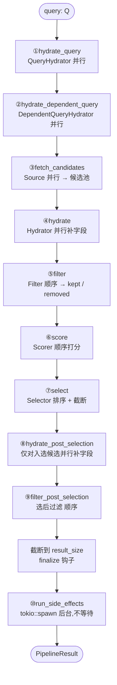

# CandidatePipeline trait（流水线执行器）

## 概述

`CandidatePipeline<Q, C>` 是 `candidate-pipeline` 框架的**执行器 trait** —— 一条推荐流水线的"主控"。它定义在 `candidate-pipeline/candidate_pipeline.rs`,职责是:接收一个 `Query`,按固定的 10 个阶段顺序调度组件,产出一份排序好的候选结果。

它与 [[candidate-pipeline-framework|七个组件 trait]] 是分工关系:组件 trait(Source、Hydrator、Filter…)定义"每类活儿怎么干";`CandidatePipeline` 定义"这些活儿按什么顺序、并行还是顺序、谁的输出喂给谁"。业务侧(`ForYouCandidatePipeline`、`PhoenixCandidatePipeline`)实现这个 trait —— 但**只需填几个返回组件列表的 getter**,真正的编排逻辑 `execute()` 由框架以**默认方法**形式提供,业务不用、也不该重写。

本页聚焦这个执行器本身:完整方法集、`execute()` 逐阶段走读、相关结构体(`PipelineStage`、`PipelineResult`、`SelectResult`)、`#[receive_stats]` 宏、日志/统计辅助函数。

## trait 定义

```rust
// candidate-pipeline/candidate_pipeline.rs:67-86
#[async_trait]
pub trait CandidatePipeline<Q, C>: Send + Sync
where
    Q: PipelineQuery,
    C: PipelineCandidate,
{
    fn query_hydrators(&self) -> &[Box<dyn QueryHydrator<Q>>];
    fn dependent_query_hydrators(&self) -> &[Box<dyn QueryHydrator<Q>>] {
        &[]
    }
    fn sources(&self) -> &[Box<dyn Source<Q, C>>];
    fn hydrators(&self) -> &[Box<dyn Hydrator<Q, C>>];
    fn filters(&self) -> &[Box<dyn Filter<Q, C>>];
    fn scorers(&self) -> &[Box<dyn Scorer<Q, C>>];
    fn selector(&self) -> &dyn Selector<Q, C>;
    fn post_selection_hydrators(&self) -> &[Box<dyn Hydrator<Q, C>>];
    fn post_selection_filters(&self) -> &[Box<dyn Filter<Q, C>>];
    fn side_effects(&self) -> Arc<Vec<Box<dyn SideEffect<Q, C>>>>;
    fn result_size(&self) -> usize;
    fn finalize(&self, _query: &Q, _candidates: &mut Vec<C>) {}

    // execute() / components() / 各阶段方法 / 辅助函数 —— 全是默认方法
}
```

`trait CandidatePipeline<Q, C>: Send + Sync` —— 执行器自身要能跨线程(它会被多个请求并发调用)。两个泛型 `Q`、`C` 的约束 `PipelineQuery` / `PipelineCandidate` 见 [[candidate-pipeline-framework]]。

## 完整方法集

trait 的方法分三类。

### 业务必须实现的 getter（10 个）

每个返回对应阶段的组件,框架的 `execute()` 靠它们取组件。

| 方法 | 返回类型 | 说明 |
|------|---------|------|
| `query_hydrators` | `&[Box<dyn QueryHydrator<Q>>]` | Query 水合器列表 |
| `dependent_query_hydrators` | `&[Box<dyn QueryHydrator<Q>>]` | 依赖型 Query 水合器,**有默认实现** `&[]` |
| `sources` | `&[Box<dyn Source<Q, C>>]` | 候选源列表 |
| `hydrators` | `&[Box<dyn Hydrator<Q, C>>]` | 候选水合器列表 |
| `filters` | `&[Box<dyn Filter<Q, C>>]` | 打分前过滤器列表 |
| `scorers` | `&[Box<dyn Scorer<Q, C>>]` | 打分器列表 |
| `selector` | `&dyn Selector<Q, C>` | 选择器(**单数** —— 一条流水线只有一个) |
| `post_selection_hydrators` | `&[Box<dyn Hydrator<Q, C>>]` | 选后候选水合器列表 |
| `post_selection_filters` | `&[Box<dyn Filter<Q, C>>]` | 选后过滤器列表 |
| `side_effects` | `Arc<Vec<Box<dyn SideEffect<Q, C>>>>` | 副作用列表,用 `Arc` 包(要 `move` 进后台任务) |
| `result_size` | `usize` | 最终结果截断到多少条 |

`dependent_query_hydrators` 默认返回空切片 —— 不需要依赖型水合的流水线可以不实现它。其余 getter 没有默认实现,业务必须给(空阶段返回 `&[]` 即可)。

注意 `side_effects` 的返回类型是 `Arc<Vec<...>>` 而非 `&[...]` —— 其它 getter 返回切片引用,它返回 `Arc`。因为 side effect 要被 `tokio::spawn` 到后台任务里执行,需要一个能 `move` 进闭包、`'static` 的所有权句柄,`Arc` 满足这点。

### 业务可选 override 的钩子（1 个）

```rust
// candidate-pipeline/candidate_pipeline.rs:86
fn finalize(&self, _query: &Q, _candidates: &mut Vec<C>) {}
```

`finalize` 默认空实现。它在选后过滤完成、结果截断之后、跑 side effect 之前被调用(`execute()` 第 119 行),给业务一个对最终候选列表做最后调整的口子(重排、注入、打标等)。不需要就不实现。

### 框架提供的默认方法（编排逻辑，业务不重写）

这些方法都有默认实现,构成执行器的全部逻辑:

- `execute(&self, query: Q) -> PipelineResult<Q, C>` —— **主入口**,编排 10 个阶段
- `components(&self) -> Vec<PipelineComponents>` —— 列出所有阶段的组件名
- `name(&self) -> &'static str` —— 流水线自身的短类型名
- 阶段方法:`hydrate_query`、`hydrate_dependent_query`、`fetch_candidates`、`hydrate`、`hydrate_post_selection`、`run_hydrators`、`filter`、`filter_post_selection`、`run_filters`、`score`、`select`、`run_side_effects`
- 辅助方法:`record_enabled_components`、`log_stage`、`log_stage_size`、`log_filters`、`stat_result_size`

## execute() —— 十阶段编排走读

`execute()` 是整个执行器的核心。完整代码:

```rust
// candidate-pipeline/candidate_pipeline.rs:88-137
#[xai_stats_macro::receive_stats(latency=Bucket500To2500)]
async fn execute(&self, query: Q) -> PipelineResult<Q, C> {
    let hydrated_query = self.hydrate_query(query).await;
    let hydrated_query = self.hydrate_dependent_query(hydrated_query).await;

    let candidates = self.fetch_candidates(&hydrated_query).await;

    let hydrated_candidates = self.hydrate(&hydrated_query, candidates).await;

    let (kept_candidates, mut filtered_candidates) =
        self.filter(&hydrated_query, hydrated_candidates.clone());

    let scored_candidates = self.score(&hydrated_query, kept_candidates).await;

    let SelectResult {
        selected: selected_candidates,
        non_selected: mut non_selected_candidates,
    } = self.select(&hydrated_query, scored_candidates);

    let post_selection_hydrated_candidates = self
        .hydrate_post_selection(&hydrated_query, selected_candidates)
        .await;

    let (mut final_candidates, post_selection_filtered_candidates) =
        self.filter_post_selection(&hydrated_query, post_selection_hydrated_candidates);
    filtered_candidates.extend(post_selection_filtered_candidates);

    let truncated_candidates =
        final_candidates.split_off(self.result_size().min(final_candidates.len()));
    non_selected_candidates.extend(truncated_candidates);

    self.finalize(&hydrated_query, &mut final_candidates);

    self.stat_result_size(&final_candidates);

    let arc_hydrated_query = Arc::new(hydrated_query);
    let input = Arc::new(SideEffectInput {
        query: arc_hydrated_query.clone(),
        selected_candidates: final_candidates.clone(),
        non_selected_candidates, // candidates are moved so we don't need to clone them
    });
    self.run_side_effects(input);

    PipelineResult {
        retrieved_candidates: hydrated_candidates,
        filtered_candidates,
        selected_candidates: final_candidates,
        query: arc_hydrated_query,
    }
}
```

逐阶段拆解:



**① Query 水合** `hydrate_query`(`candidate_pipeline.rs:90, 202-218`)
所有 `QueryHydrator` 经 `enable()` 过滤后,`join_all` **并行**跑 `run()`,产出一批 `Result<Q>`;然后顺序 `zip` 逐个 `update()` 合并进 query。失败的(`Err`)跳过其 `update`。返回填好初始字段的 query。

**② 依赖型 Query 水合** `hydrate_dependent_query`(`:91, 229-248`)
逻辑与 ① 完全相同,只是用 `dependent_query_hydrators()`。开头有短路:`if all.is_empty() { return query; }` —— 没有依赖型水合器就直接返回,连 `Instant::now()` 都不调。它在 ① **之后**跑,因此能读到 ① 填好的字段。

**③ 拉候选** `fetch_candidates`(`:93, 257-272`)
所有 `Source` 经 `enable()` 过滤后 `join_all` **并行**跑。结果用 `results.into_iter().flatten()` 摊平 —— `Err` 的源被直接丢弃,只有 `Ok(Vec<C>)` 进池;逐个 `append` 拼成一个总 `Vec<C>`。把候选数记进 span 的 `candidate_count` 字段。

**④ 候选水合** `hydrate`(`:95, 280-283`)
委托给 `run_hydrators`(`:302-319`)。所有 `Hydrator` 经 `enable()` 过滤后 `join_all` **并行**跑,各产出 `Vec<Result<C,String>>`;然后顺序 `zip` 逐个 `update_all()` 合并。这里候选数量不变(Hydrator 等长契约)。

**⑤ 过滤** `filter`(`:97-98, 331-333`)
委托给 `run_filters`(`:355-386`)。注意 `execute()` 这里传的是 `hydrated_candidates.clone()` —— 克隆一份,因为原始的 `hydrated_candidates` 还要放进 `PipelineResult.retrieved_candidates`。`run_filters` 用 **for 循环顺序**跑每个启用的 `Filter`:`candidates = result.kept` 把上个 filter 的 kept 喂给下个,`all_removed.extend(result.removed)` 累积所有 removed。返回 `(kept, all_removed)`。`filtered_candidates` 收 removed。

**⑥ 打分** `score`(`:100, 394-404`)
所有 `Scorer` 经 `enable()` 过滤后,**for 循环顺序**跑:每个 scorer `run()` 产出 `Vec<Result<C>>`,立即 `update_all()` 写回 `candidates`;下个 scorer 看到的是更新后的候选。候选数量不变。

**⑦ 选择** `select`(`:102-105, 407-416`)
`select` 方法先查 `selector().enable(query)`:启用则调 `selector().run()` 排序 + 截断,产出 `SelectResult { selected, non_selected }`;**未启用**则原样返回 `SelectResult { selected: candidates, non_selected: vec![] }`(不排不截)。`execute()` 用模式匹配解构出 `selected_candidates` 和 `non_selected_candidates`。

**⑧ 选后水合** `hydrate_post_selection`(`:107-109, 291-299`)
同样委托 `run_hydrators`,但用 `post_selection_hydrators()`,且**只对 `selected_candidates`(已入选的那批)**跑。语义:有些昂贵的水合(品牌安全、可见性数据)只值得对最终会展示的候选做,放在选择之后省成本。

**⑨ 选后过滤** `filter_post_selection`(`:111-113, 345-352`)
委托 `run_filters`,用 `post_selection_filters()`。产出的 `removed` 用 `filtered_candidates.extend(...)` 并进第 ⑤ 步的 removed 里 —— `PipelineResult.filtered_candidates` 因此包含**两道过滤**剔除的全部候选。

**截断 + finalize**(`:115-119`)
`final_candidates.split_off(result_size().min(len))` —— 按 `result_size()` 截断,多出来的 `truncated_candidates` 并进 `non_selected_candidates`。然后调 `finalize()` 钩子(默认空)给业务最后修改 `final_candidates` 的机会。

**stat + ⑩ side effect**(`:121-129`)
`stat_result_size()` 把最终结果数发进直方图。然后 `Arc::new(hydrated_query)`、构造 `Arc<SideEffectInput>`(打包 query、入选、落选);`run_side_effects(input)` 用 `tokio::spawn` 把 side effect 丢后台 —— **`execute()` 不等它们完成**。

**返回 `PipelineResult`**(`:131-136`)
`retrieved_candidates` = ④ 水合后的全量候选;`filtered_candidates` = 两道过滤剔除的;`selected_candidates` = `final_candidates`;`query` = `arc_hydrated_query`。

整个 `execute()` 带 `#[xai_stats_macro::receive_stats(latency=Bucket500To2500)]` —— 一次完整流水线执行的延迟落进 500~2500ms 的桶。

## PipelineStage 枚举

```rust
// candidate-pipeline/candidate_pipeline.rs:21-33
#[derive(Copy, Clone, Debug)]
pub enum PipelineStage {
    QueryHydrator,
    DependentQueryHydrator,
    Source,
    Hydrator,
    PostSelectionHydrator,
    Filter,
    PostSelectionFilter,
    Scorer,
    Selector,
    SideEffect,
}
```

10 个变体,标识流水线的 10 个阶段。它**不参与 `execute()` 的控制流**(`execute()` 是写死的方法调用序列,不靠枚举驱动)。`PipelineStage` 的用途是给 `components()` 做**分类标签**:`components()` 产出 `Vec<PipelineComponents>`,每个 `PipelineComponents` 把一个 `PipelineStage` 和该阶段的组件名列表配对。

注意枚举里变体的排列顺序(`PostSelectionHydrator` 排在 `Filter` 前、`PostSelectionFilter` 排在 `Scorer` 前)和 `execute()` 实际执行顺序**不一致** —— 枚举只是一个标签集合,顺序无语义。`run_hydrators` / `run_filters` 收一个 `_stage: PipelineStage` 参数但**带下划线前缀,当前未使用**。

## PipelineComponents 与 components()

```rust
// candidate-pipeline/candidate_pipeline.rs:35-38
pub struct PipelineComponents {
    pub stage: PipelineStage,
    pub components: Vec<String>,
}
```

`components()` 方法(`:140-188`)遍历全部 getter,为每个阶段产出一个 `PipelineComponents`。内部有个本地泛型函数 `stage<T>`,把一个组件切片映射成名字列表:

```rust
// candidate-pipeline/candidate_pipeline.rs:141-153
fn stage<T: ?Sized>(
    stage: PipelineStage,
    items: &[Box<T>],
    name: impl Fn(&T) -> &str,
) -> PipelineComponents {
    PipelineComponents {
        stage,
        components: items
            .iter()
            .map(|item| name(item.as_ref()).to_string())
            .collect(),
    }
}
```

`selector()` 因为是单个而非切片,单独构造:`components: vec![self.selector().name().to_string()]`(`:168-171`)。`components()` 的产物适合用来打印/自检一条流水线挂了哪些组件 —— [[system-architecture]] 里那张"内层流水线 15 个 query 水合器 / 6 个源 / …"的表,本质就是这个方法的输出。

## PipelineResult 结构

```rust
// candidate-pipeline/candidate_pipeline.rs:40-58
pub struct PipelineResult<Q, C> {
    pub retrieved_candidates: Vec<C>,
    pub filtered_candidates: Vec<C>,
    pub selected_candidates: Vec<C>,
    pub query: Arc<Q>,
}

impl<Q: Default, C> PipelineResult<Q, C> {
    /// Create an empty result with a default query. Useful for short-circuiting
    /// requests (e.g. test users) without running the pipeline.
    pub fn empty() -> Self {
        Self {
            retrieved_candidates: vec![],
            filtered_candidates: vec![],
            selected_candidates: vec![],
            query: Arc::new(Q::default()),
        }
    }
}
```

`execute()` 的返回值。四个字段:

| 字段 | 内容 |
|------|------|
| `retrieved_candidates` | 阶段 ④ 水合后的**全量**候选(过滤之前) |
| `filtered_candidates` | 阶段 ⑤ 和 ⑨ **两道过滤**剔除的候选合集 |
| `selected_candidates` | 最终入选、已截断到 `result_size` 的结果 |
| `query` | `Arc<Q>` —— 水合完成后的 query |

`PipelineResult::empty()` 是一个**短路出口**:当请求不该跑流水线(文档举例"测试用户")时,直接返回一份全空、query 取 `Q::default()` 的结果,跳过整个 `execute()`。它要求 `Q: Default`(注意 trait 边界里 `Q: PipelineQuery` 不含 `Default`,所以 `empty()` 在一个独立的 `impl<Q: Default, C>` 块里)。

## SelectResult 结构

```rust
// candidate-pipeline/selector.rs:6-19
pub struct SelectResult<C> {
    pub selected: Vec<C>,
    pub non_selected: Vec<C>,
}

impl<C> SelectResult<C> {
    pub fn len(&self) -> usize {
        self.selected.len()
    }
    pub fn is_empty(&self) -> bool {
        self.selected.is_empty() && self.non_selected.is_empty()
    }
}
```

`select` 阶段(⑦)的产物。`selected` 进后续阶段,`non_selected` 是落选的。`execute()` 用 `let SelectResult { selected, non_selected } = ...` 解构它。`len()` 只数 `selected`;`is_empty()` 要求两个向量**都空**才算空。该结构体定义在 `selector.rs`,但 `execute()` 在 `candidate_pipeline.rs` 里消费它。

## PipelineQuery / PipelineCandidate 约束

`execute()` 的两个泛型必须满足:

```rust
// candidate-pipeline/candidate_pipeline.rs:59-65
pub trait PipelineQuery: Clone + Send + Sync + 'static {
    fn params(&self) -> &xai_feature_switches::Params;
    fn decider(&self) -> Option<&xai_decider::Decider>;
}

pub trait PipelineCandidate: Clone + Send + Sync + 'static {}
impl<T> PipelineCandidate for T where T: Clone + Send + Sync + 'static {}
```

- `PipelineQuery`:`execute()` 全程要 `clone` query(进 `Arc`)、跨 await 点持有,故 `Clone + Send + Sync + 'static`。`params()` / `decider()` 是各组件 `enable()` 做实验开关的数据来源。
- `PipelineCandidate`:空 trait + blanket impl,任何 `Clone + Send + Sync + 'static` 类型自动满足。`execute()` 里 `hydrated_candidates.clone()`、`final_candidates.clone()` 等操作要求候选可克隆。

更多见 [[candidate-pipeline-framework]]。

## #[receive_stats] 宏

`#[xai_stats_macro::receive_stats(...)]` 是一个**过程宏属性**,贴在 async 方法上,自动给该方法包一层统计埋点 —— 把方法的执行延迟(以及可选的 size)记进指定的直方图桶,无需手写埋点代码。

执行器里它出现在 `execute()` 上:

```rust
// candidate-pipeline/candidate_pipeline.rs:88
#[xai_stats_macro::receive_stats(latency=Bucket500To2500)]
async fn execute(&self, query: Q) -> PipelineResult<Q, C> { ... }
```

`latency=Bucket500To2500` 指定把 `execute()` 的耗时记进 500~2500ms 这档直方图桶 —— 这是对"一次完整流水线执行"延迟的预期区间。框架里其它组件 trait 的 `run()` 也都贴了这个宏,但配的桶不同(Filter 用 `Bucket0To50`、Hydrator 用 `Bucket50To500` 等),反映各阶段不同的耗时量级。完整对照见 [[candidate-pipeline-framework]] 的"可观测性"一节。

## 日志与统计辅助函数

执行器把日志/统计逻辑抽成几个默认方法,各阶段方法复用它们。

### record_enabled_components

```rust
// candidate-pipeline/candidate_pipeline.rs:435-454
fn record_enabled_components<'a, T: 'a>(
    items: impl Iterator<Item = &'a T>,
    is_enabled: impl Fn(&T) -> bool,
    get_name: impl Fn(&T) -> &str,
) {
    let mut total = 0usize;
    let mut disabled: Vec<&str> = Vec::new();
    for item in items {
        total += 1;
        if !is_enabled(item) {
            disabled.push(get_name(item));
        }
    }
    let span = Span::current();
    span.record("total_count", total);
    span.record("enabled_count", total - disabled.len());
    if !disabled.is_empty() {
        span.record("disabled", disabled.join(",").as_str());
    }
}
```

每个阶段方法(`hydrate_query`、`fetch_candidates`、`run_hydrators`、`run_filters`、`score`)在过滤组件**之前**都先调它一次。它遍历组件,把 `total_count`、`enabled_count` 记进当前 tracing span;若有禁用组件,把它们的名字逗号拼接记进 `disabled` 字段。这就是"一条流水线挂了 14 个 filter、本次请求只启用 11 个、禁用了哪 3 个"在 trace 里可见的来源。

### log_stage / log_stage_size / log_filters

```rust
// candidate-pipeline/candidate_pipeline.rs:458-476
fn log_stage(&self, start: Instant) {
    info!("latency_ms={}", start.elapsed().as_millis());
}

fn log_stage_size(&self, start: Instant, size: usize) {
    info!("latency_ms={} size={}", start.elapsed().as_millis(), size);
}

fn log_filters(&self, kept: usize, removed: usize, removed_per_filter: &[(String, usize)]) {
    let removed_summary = removed_per_filter
        .iter()
        .map(|(name, removed)| format!("{}={}", name, removed))
        .collect::<Vec<_>>()
        .join(",");
    info!(
        "kept {}, removed {} removed_per_filter [{}]",
        kept, removed, removed_summary,
    );
}
```

- `log_stage`:只打延迟。`hydrate_query` / `hydrate_dependent_query` 用它(query 水合不改候选数,无 size 可言)。
- `log_stage_size`:打延迟 + 候选数。`fetch_candidates`、`run_hydrators`、`score` 用它。
- `log_filters`:打 kept / removed 总数,以及每个 filter 各剔除了多少(`removed_per_filter` 是 `run_filters` 累积的 `(filter名, removed数)` 列表)。`run_filters` 用它。

三个都是 `info!` 级日志,在每个阶段末尾调一次。

### stat_result_size

```rust
// candidate-pipeline/candidate_pipeline.rs:478-492
fn stat_result_size(&self, final_candidates: &[C]) {
    if let Some(receiver) = global_stats_receiver() {
        let response_size = final_candidates.len();
        let metric_name = format!("{}.execute", self.name());
        receiver.observe(
            metric_name.as_str(),
            &FINAL_RESULT_SIZE_SCOPE,
            response_size as f64,
            HistogramBuckets::Bucket0To50,
        );
        if response_size == 0 {
            receiver.incr(metric_name.as_str(), &FINAL_RESULT_EMPTY_SCOPE, 1u64);
        }
    }
}
```

`execute()` 在返回前调一次。它把最终结果数 `observe` 进 `<流水线名>.execute` 指标的 `Bucket0To50` 桶;若结果**为空**,额外 `incr` 一个 `result_empty` 计数器 —— 这是监控"流水线返回了空结果"这一异常情况的告警信号源。两个 scope 常量定义在文件顶部:

```rust
// candidate-pipeline/candidate_pipeline.rs:18-19
const FINAL_RESULT_SIZE_SCOPE: [(&str, &str); 1] = [("requests", "result_size")];
const FINAL_RESULT_EMPTY_SCOPE: [(&str, &str); 1] = [("requests", "result_empty")];
```

开头的 `if let Some(receiver) = global_stats_receiver()` 是兜底 —— 没配全局 stats receiver(如单测环境)就整段跳过,不会 panic。

### name()

```rust
// candidate-pipeline/candidate_pipeline.rs:190-192
fn name(&self) -> &'static str {
    util::short_type_name(type_name_of_val(self))
}
```

流水线自身的短类型名,用 `util::short_type_name`(把全限定名截到最后一段,`util.rs:1-3`)。`stat_result_size` 用它拼指标名 `<name>.execute`。

## 关键事实速查

| 项 | 值 |
|----|----|
| 文件 | `candidate-pipeline/candidate_pipeline.rs`（约 494 行） |
| trait | `CandidatePipeline<Q, C>: Send + Sync`，带 `#[async_trait]` |
| 业务必实现 | 10 个 getter（`dependent_query_hydrators` 有默认 `&[]`） |
| 业务可选 override | `finalize`（默认空） |
| 主入口 | `execute(&self, query: Q) -> PipelineResult<Q, C>` |
| 阶段数 | 10（`PipelineStage` 枚举） |
| `execute()` 埋点 | `#[receive_stats(latency=Bucket500To2500)]` |
| 短路出口 | `PipelineResult::empty()`（要求 `Q: Default`） |
| side effect 调度 | `tokio::spawn`，不阻塞 `execute()` 返回 |

## 设计决策

| 决策点 | 选择 | 理由 |
|--------|------|------|
| 编排逻辑放哪 | `execute()` 作为 trait **默认方法**,业务不重写 | 10 阶段的顺序、并行性、错误处理全框架统一保证,业务只填组件,不可能写错编排 |
| 业务接口形态 | 业务只实现"返回组件列表"的 getter | 把"流水线由哪些组件构成"和"组件按什么顺序跑"彻底解耦 |
| `execute()` 控制流 | 写死的方法调用序列,不靠 `PipelineStage` 枚举驱动 | 阶段固定不变,写死最直接;枚举仅作 `components()` 的分类标签 |
| selector 单数 | `selector()` 返回 `&dyn Selector`,不是切片 | 一条流水线只有一个"排序+截断"语义,多个无意义 |
| `side_effects` 返回 `Arc` | 其它 getter 返回 `&[]`,它返回 `Arc<Vec<...>>` | side effect 要 `move` 进 `tokio::spawn` 的后台任务,需 `'static` 所有权句柄 |
| 选后再水合/过滤 | 设 `post_selection_hydrators` / `post_selection_filters` 两个独立阶段 | 昂贵的水合(品牌安全/可见性)只对最终入选的候选做,省成本 |
| `retrieved` vs `filtered` | `PipelineResult` 同时保留全量候选和被剔除候选 | 便于调试/审计:能回看流水线召回了什么、过滤掉了什么 |
| 空结果短路 | `PipelineResult::empty()` 独立构造器 | 测试用户等场景直接返回空,不跑 `execute()` |
| 空结果监控 | `stat_result_size` 对空结果额外 `incr` 一个计数器 | "流水线返回空"是异常,需独立告警信号 |

## 源码锚点

- `candidate-pipeline/candidate_pipeline.rs:21-33` —— `PipelineStage` 十阶段枚举
- `candidate-pipeline/candidate_pipeline.rs:35-38` —— `PipelineComponents`
- `candidate-pipeline/candidate_pipeline.rs:40-58` —— `PipelineResult` 与 `empty()`
- `candidate-pipeline/candidate_pipeline.rs:59-65` —— `PipelineQuery` / `PipelineCandidate`
- `candidate-pipeline/candidate_pipeline.rs:67-86` —— `CandidatePipeline` trait 头与 getter
- `candidate-pipeline/candidate_pipeline.rs:88-137` —— `execute()` 编排主流程
- `candidate-pipeline/candidate_pipeline.rs:140-188` —— `components()`
- `candidate-pipeline/candidate_pipeline.rs:202-416` —— 各阶段方法实现
- `candidate-pipeline/candidate_pipeline.rs:419-428` —— `run_side_effects`
- `candidate-pipeline/candidate_pipeline.rs:435-492` —— 辅助方法(`record_enabled_components`、日志、`stat_result_size`)
- `candidate-pipeline/selector.rs:6-19` —— `SelectResult`

## 相关页面

- [[candidate-pipeline-framework]] —— 执行器调度的七个组件 trait 的签名与契约
- [[system-architecture]] —— `CandidatePipeline` 在两层嵌套流水线里的实际用法与全局视角
- [[home-mixer-orchestration]] —— 实现本 trait 的两条真实流水线如何组装组件、暴露 gRPC
- [[run-pipeline]] —— 驱动一条 `CandidatePipeline::execute()` 跑起来的入口构件
- [[filtering-pipeline]] —— `execute()` 第 ⑤、⑨ 步两道过滤的具体过滤器
- [[scoring-and-ranking]] —— `execute()` 第 ⑥ 步打分阶段的具体打分器链
- [[candidate-selection]] —— `execute()` 第 ⑦ 步选择阶段与选后成型步骤
