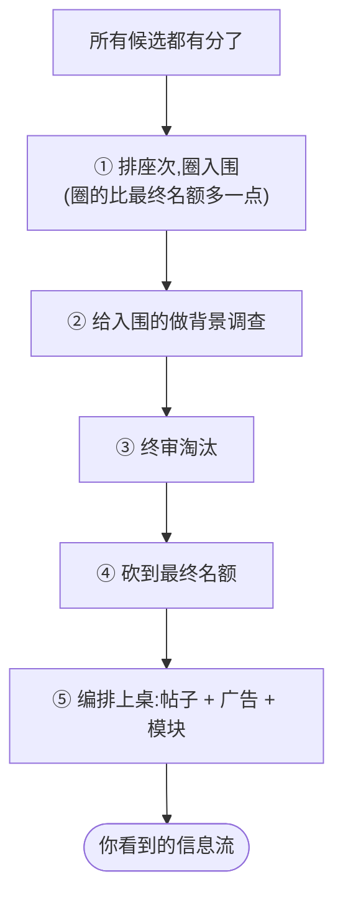

# 白话 —— 帖子是怎么被选中的

> 接着 [[how-it-works]] 的第 ④ 步往下讲:每条候选都打完分了,然后呢?
> 系统怎么从一大堆带分的候选里,定下最终递给你的那几十条。零代码 —— 想看技术细节走 [[candidate-selection]]。

## 一句话

打完分之后,系统**按分排好队、圈出靠前的一批,再做几道收尾筛查和编排**,才定下你看到的信息流。

## 把它想成一场选秀的收尾

前面 [[how-it-works|召回 + 打分]] 相当于海选和评委打分。打完分,进入收尾环节:

## ① 排座次,圈入围

把所有候选**按最终分从高到低排队**,圈出靠前的一批。

关键细节:**圈的比最终名额多一点**。比如最终要给你 20 条,这一步可能先圈 30 条。

> 为什么多圈?因为后面还有淘汰。先留点余量,免得淘汰完不够数。

## ② 给入围的做"背景调查"

对圈中的这批候选,系统才去查那些**"贵"的信息**:这条帖子现在还可见吗(没被删、没被判违规)?广告主敢不敢挨着它投广告?

> 为什么只对入围的查?查这些既慢又费资源。对那些根本没圈进来的候选查了也是白查 —— 所以放到圈定之后,只查这一小批。

## ③ 终审淘汰

背景调查完,有些候选**虽然分高,但出了问题**,直接淘汰:

- 帖子已经被删除、或被判定不该展示;
- 它和某条已经入选的帖子,是**同一条对话串里的重复内容**(同一个讨论,留一条就够)。

## ④ 砍到最终名额

淘汰之后,再从高分往下**砍到最终条数**。

这就回答了第 ① 步的伏笔 —— 因为先多圈了一些,淘汰几个之后,剩下的还够铺满你的信息流。

## ⑤ 编排上桌

最后一步,把选定的帖子和**广告、"推荐关注"模块、提示卡**等编排在一起,排成你刷到的样子。广告怎么找位置插进去,见 [[ads-blending|广告混排]]。

## 落选的候选去哪了?

不会凭空消失。系统留了一份"落选名单"(技术上叫 `non_selected`)—— 不展示给你,但会留作记录和分析。

## 一句话回顾

排座次 → 圈入围(略多)→ 背景调查 → 终审淘汰 → 砍到名额 → 编排上桌。这一串就是"选帖过程"。

## 出处

本页是对技术页的白话综合,不引入新结论。核心结论的依据(精确行号见对应技术页的「源码锚点」):

| 核心结论 | 技术页 | 主要源码 |
|----------|--------|----------|
| 选择 = 按分排序 + 截断 | [[candidate-selection]] | `candidate-pipeline/selector.rs:21-85` |
| 内层按最终分取 top-K | [[candidate-selection]] | `home-mixer/selectors/top_k_score_selector.rs:8-15` |
| 先圈较多、选后过滤后再砍到最终条数 | [[candidate-selection]] | `candidate-pipeline/candidate_pipeline.rs:102-119` |
| "背景调查 / 终审"只对入选候选做 | [[filtering-pipeline]] | `home-mixer/candidate_pipeline/phoenix_candidate_pipeline.rs:304-321` |
| 编排上桌:帖子与广告 / 模块组装 | [[ads-blending]] | `home-mixer/selectors/blender_selector.rs:24-75` |

## 相关页面

- [[candidate-selection]] —— 本页的技术版:选择阶段完整细节
- [[how-it-works]] —— 端到端白话总览(本页是其第 ④-⑤ 步的放大)
- [[glossary]] —— 术语速查表
- [[faq]] —— 常见疑问
